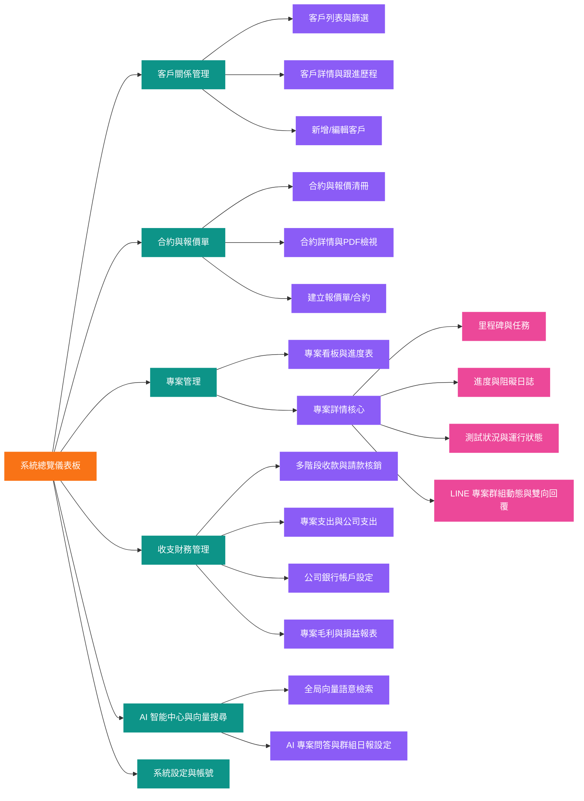
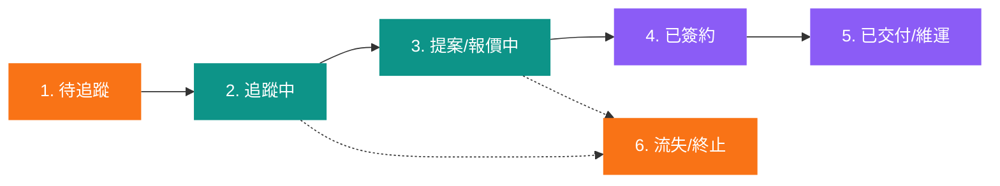

# 產品需求文檔 (PRD) - 立衡軟體開發專案與營運管理內部系統

> **文件說明**: 本文檔依據《客戶需求採集表 SRS》轉化而來，詳細定義系統產品範疇、功能架構、業務流程、UI 結構、角色權限、驗收標準與非功能需求，作為 UI/UX 設計、前後端開發 (Frontend/Backend) 與 QA 測試之基準規範。

---

## 0. 文件修訂紀錄 (Revision History)

| 版本 | 修訂日期 | 修訂者 | 變更說明 / 摘要 | 狀態 |
| :---: | :---: | :---: | :--- | :---: |
| v1.0.0 | 2026-08-14 | PM / Arch Team | 初稿建立：整合 CRM 客戶、合約報價、WBS 專案、多階段收支毛利、LINE 專案群組 AI 雙向協同、全局向量語意檢索 (pgvector)。 | 待審核 |
| v1.0.1 | 2026-08-14 | PM / Arch Team | 規格對齊：完全禁用 Emoji、採用亮色主題、規範單號編碼 (年月日+四碼序號)、PWA 支援、@kawawei/frontend-modules 組件庫、Redis 原子計數與 WebSocket 即時推播規範。 | 待審核 |

---

## 1. 專案概述與目標 (Overview & Goals)

### 1.1 背景與痛點 (Problem Statement)
* **商務客戶追蹤散亂**: 缺乏集中管道記錄潛在客戶到正式簽約的跟進歷程，報價單與合約版本混亂。
* **專案進度與 LINE 溝通斷層**: 接案涵蓋提案、規格、開發、測試到上線維運，工程師與客戶使用個人 LINE 溝通，重要需求與 Bug 回報易漏訊，缺乏與專案關聯的集中儀表板。
* **多階段收款與專案毛利核算困難**: 客製化專案多採分期付款（訂金/交付款/尾款），專案支出（主機伺服器、第三方 API/LLM Token、外包費用）與公司常態支出混淆，難以精確核算單案實際毛利。

### 1.2 產品核心價值 (Product Value)
1. **商務與合約閉環**: 掌握客戶生命週期（待追蹤 -> 追蹤中 -> 提案報價 -> 已簽約 -> 已交付），報價單與合約簽署狀態清晰。
2. **專案管理透明度**: 7 大生命週期階段、里程碑進度表、工程師定期回報日誌、Bug 測試與運行狀況監控。
3. **精準財務與專案毛利 (P&L)**: 多階段請款發票與銀行入帳核銷，專案成本獨立核算，自動計算毛利率，支援 Excel/CSV 財務匯出。
4. **LINE 專案群組 AI 協同**: LINE 官方 Bot 邀請進專案群組，實現對話自動同步回系統、後台雙向發布回傳、AI 自動摘要待辦、定時進度推播。
5. **全局向量語意檢索 (RAG)**: 基於 pgvector 實現跨客戶、專案、合約與對話紀錄的自然語言語意搜尋與 AI 專案問答。

### 1.3 專案範疇界定 (Scope Boundary)
* **第一階段包含 (In-Scope - Phase 1)**:
  * [CRM] 客戶分類、追蹤狀態、基本資料、拜訪跟進歷程。
  * [Contracts] 報價單與合約管理、狀態流轉（洽談中/待簽署/已簽署/已結案）、PDF 附件上傳、單號自動產生 (`QT-YYYYMMDD-XXXX`, `CT-YYYYMMDD-XXXX`)。
  * [WBS] 專案 7 大階段、工程師指派、里程碑進度、日誌回報、測試與運行健康度、專案單號 (`PJ-YYYYMMDD-XXXX`)。
  * [Finance] 多階段收款期程（含稅/未稅/發票/入帳帳戶）、專案專屬支出 vs 公司支出、多銀行帳戶管理、專案毛利即時分析、清冊匯出、單號 (`REC-YYYYMMDD-XXXX`, `EXP-YYYYMMDD-XXXX`)。
  * [LINE & AI] 邀請 LINE Bot 入專案群組 (方案 B)、Webhook 對話同步、後台回傳訊息至 LINE 群、@AI 提煉待辦、定時進度推播。
  * [Search] 全局向量語意檢索 (pgvector Embeddings) 與 AI 知識問答。
  * [UI & Tech] 亮色主題、RWD 自適應、PWA 行動裝置支援、@kawawei/frontend-modules 組件庫、WebSocket 即時數據同步。
  * [Auth] 極簡雙角色：超級管理員 (Super Admin)、工程師 (Engineer)；JWT 8 小時過期自動跳轉。
* **後續階段規劃 (Out-of-Scope - Phase 2)**:
  * 機敏資訊金鑰庫 (Vault AES-256 加密與遮罩)、多環境微服務日誌深度採集器 (Loki/ELK)、開發者帳號管理 (Apple/Google)、內部技術 Wiki、硬體打樣與 BOM 管理。

### 1.4 目標用戶畫像 (User Personas)
* **超級管理員 (Alex - 經營者/主管)**:
  * 需求：一眼掌握全公司所有專案的進度健康度、本月應收未收款、各專案實際毛利率、查閱客戶合約與財務報表。
* **工程師 (Sam - RD / 開發人員)**:
  * 需求：清楚知道被指派的專案任務、快速填寫每週/每日進度回報、提報專案伺服器或 API 採購費用、在系統或 LINE 群組接收客戶反饋並回報修復進度。

---

## 2. 系統架構與頁面結構 (System Architecture & Page Structure)

### 2.1 頁面結構圖 (Page Flowchart)
> 說明：採用 Mermaid Flowchart (LR 方向)，依層級套用樣式規範。

---

## 3. 功能模組詳細規格 (Functional Specifications)

### 3.1 客戶關係管理模組 (CRM)

* **客戶分類**: 潛在客戶 (Lead)、正式客戶 (Client)、結案客戶 (Archived)。
* **客戶基本資料欄位**: 公司名稱、統一編號、所屬行業、聯絡人姓名、職稱、聯絡電話、Email、Line/WeChat ID、公司地址、客戶來源標籤 (老客戶回購/介紹/官網諮詢等)、備註。
* **跟進歷程 (Activity Timeline)**: 記錄聯繫日期、聯繫方式 (會議/電話/拜訪/LINE 訊息)、業務負責人、溝通要點、下次跟進事項 (Next Action) 與提醒日期。
* **商務連動**: 可在客戶詳情頁直接查看該客戶名下關聯的所有報價單/合約、進行中專案與累計收款金額。

---

### 3.2 合約與報價單管理模組 (Contracts & Quotations)

* **單據類型與編號規則 (年月日+四位流水號)**:
  * 報價單: `QT-YYYYMMDD-XXXX` (如 `QT-20260814-0001`)
  * 委託開發合約: `CT-YYYYMMDD-XXXX` (如 `CT-20260814-0001`)
  * 維護/保固合約: `MA-YYYYMMDD-XXXX` (如 `MA-20260814-0001`)
* **合約狀態機 (State Machine)**:
  * 洽談中 (Negotiating) -> 待簽署 (Pending Signature) -> 已簽署 (Signed / Active) -> 已結案/作廢 (Closed / Void)。
* **金額與條款欄位**:
  * 未稅金額、營業稅額 (預設 5% 自動計算)、含稅總金額、幣別。
  * 合約有效起訖日、付款期程條件約定說明。
  * 支援上傳合約用印掃描 PDF / 報價單 PDF 附件，並提供線上預覽。
* **專案自動建案連動**: 合約狀態變更為已簽署時，系統提示一鍵建立對應之專案 (WBS) 並自動代入客戶名稱、合約金額與多階段收款期程。

---

### 3.3 專案進度與管理模組 (WBS)

* **專案單號編碼**: `PJ-YYYYMMDD-XXXX` (如 `PJ-20260814-0001`)。
* **專案基本屬性**: 專案代碼、專案名稱、所屬客戶、關聯簽約合約、負責工程師名單 (可多選)、預計起訖日期、實際起訖日期、當前階段。
* **里程碑與進度管理 (Milestones)**: 專案可自訂多個里程碑節點（如：UI 完稿、API 交付、UAT 測試、正式上線），標記完成進度百分比 (0% ~ 100%)。
* **工程師進度回報日誌 (Progress Log)**: 工程師可按日/週填寫進度日誌：已完成項目、進行中項目、遭遇技術或時程阻礙 (Blockers)、需要支援事項。
* **測試與線上運行狀況 (QA & Health Status)**:
  * 測試狀況: Bug 清單、缺陷等級 (Critical / Major / Minor)、修復狀態 (Open / In Progress / Resolved / Verified)、驗收通過率。
  * 運行狀況: 線上系統健康狀態 (正常 / 警告 / 異常)、伺服器對外網址/Port、最近異常事件紀錄日誌。

---

### 3.4 財務收支與帳戶管理模組 (Finance & Profitability)

#### 3.4.1 多階段收款管理 (Invoicing & Receivables)
* **自訂收款階段**: 支援彈性設定各階段比例與金額（例：訂金 30%、期中交付 30%、驗收交付 30%、保固尾款 10%）。
* **收款單號編碼**: `REC-YYYYMMDD-XXXX` (如 `REC-20260814-0001`)。
* **收款欄位與狀態追蹤**:
  * 階段名稱、預計請款日、未稅金額、稅額、含稅應收金額。
  * 請款核銷狀態: 待請款 -> 已請款 (已開發票) -> 已入帳 (核銷完成) -> 逾期未付。
  * 發票資訊: 開立日期、發票號碼 (如 AB-12345678)、備註。
  * 實收入帳: 實收日期、實收金額、入帳銀行帳戶（由公司銀行清單中選擇）。

#### 3.4.2 專案與公司支出管理 (Expenses & Cost Attribution)
* **支出單號編碼**: `EXP-YYYYMMDD-XXXX` (如 `EXP-20260814-0001`)。
* **支出雙向歸屬**:
  1. 專案專屬支出 (Project Costs): 伺服器/主機租用、第三方 API 與服務、外包技術與 UI 費用。
  2. 公司營運支出 (General Overhead): 辦公室租金、水電水網、共用軟體、常態雜支。
* **支出明細紀錄**: 支出項目名稱、日期、類別、金額 (含稅/未稅)、供應商、發票/收據號碼、憑證附件上傳、付款銀行帳戶、付款狀態 (待付款 / 已付款)。

#### 3.4.3 公司銀行帳戶 (Bank Accounts)
* 記錄公司名下收付款帳戶：銀行代號、銀行名稱、分行名稱、帳號、戶名、帳戶用途說明。

#### 3.4.4 專案損益分析與清冊匯出 (P&L & Export)
* **單案損益看板**:
  $$\text{專案實際毛利} = \text{已入帳金額} - \text{專案總支出成本}$$
  $$\text{專案毛利率 (\%)} = \frac{\text{專案實際毛利}}{\text{已入帳金額}} \times 100\%$$
* **財務清冊匯出**: 支援將篩選後的收款紀錄與收支清單一鍵匯出為標準 Excel / CSV 文件，方便會計師營業稅申報與查帳。

---

### 3.5 LINE 專案群組雙向同步與 AI 智能助理 (Social & AI Agent)

* **群組協同綁定機制 (方案 B)**: 業務/工程師建立個人 LINE 客戶專案群組後，將 LINE Bot 邀請入群。Bot 加入群組觸發 join 事件，系統獲取 groupId，管理員在後台將該群組與專案綁定。
* **訊息雙向同步**:
  * LINE -> 系統: 群組中客戶與團隊成員對話、照片、檔案，即時同步至該專案的「溝通動態紀錄」，顯示發言者 LINE 暱稱。
  * 系統 -> LINE: 管理員或工程師在系統後台對該專案發送訊息，LINE Bot 自動以助理身分在該 LINE 群組推播回覆。
* **AI 智能助理能力**:
  * @AI 指令互動: 群組中 @AI 可直接記錄待辦（例如：`@AI 記錄：客戶希望登入頁增加 Line Login`），自動建立專案待辦。
  * 對話摘要與需求提煉: AI 定期或即時分析群組對話，提煉客戶新增需求與 Bug，生成 Action Items 供工程師確認。
  * 定時進度推播: 依設定之排程（如每週五 17:00），自動在群組發送本週專案進度報告。

---

### 3.6 全局向量語意檢索 (Vector Search & RAG)
* **資料向量化架構**: 資料庫採用 PostgreSQL + pgvector 擴充。系統自動將客戶資料、合約內容、專案進度日誌、測試回報、LINE 溝通紀錄透過 Embedding 模型轉為高維向量存儲。
* **自然語言語意搜尋 (Semantic Search)**: 支援在系統頂部輸入自然語言句子，系統透過向量相似度直接命中目標客戶與合約。
* **AI 專案問答 (RAG Chat)**: 提供 AI 智慧問答介面，管理員或工程師可直接提問專案狀況，AI 自動檢索相關資料彙整精準回答。

---

## 4. 角色與權限矩陣 (RBAC Matrix)

| 功能模組 / 操作權限 | 超級管理員 (Super Admin) | 工程師 (Engineer) |
| :--- | :---: | :---: |
| 客戶管理 (CRM): 檢視 / 新增 / 編輯 / 刪除 | 完整權限 | 僅檢視關聯專案之客戶 |
| 合約與報價 (Contracts): 檢視 / 建立 / 上傳 / 狀態變更 | 完整權限 | 僅檢視關聯專案之合約規格 |
| 專案管理 (WBS): 建立專案 / 階段變更 / 指派工程師 | 完整權限 | 僅檢視被指派專案 |
| 進度與測試回報: 填寫日誌 / 更新 Bug 與運行狀態 | 完整操作 | 完整操作 |
| 財務管理 (Finance): 請款發票 / 銀行帳戶 / 專案毛利 / 匯出 | 完整權限 | 無權限 (隱藏) |
| 專案支出提報: 提報伺服器/API 採購費用 | 審核與核銷 | 填寫提報 |
| LINE 群組與雙向回覆: 綁定群組 / 發布訊息 / 接收動態 | 完整權限 | 被指派專案可回覆 |
| 全局向量搜尋與 AI 問答: 搜尋與提問 | 完整資料範圍 | 限指派專案與技術資料 |
| 系統設定與帳號管理: 新增帳號 / 角色指派 | 完整權限 | 無權限 |

---

## 5. 非功能性需求 (Non-Functional Requirements)

### 5.1 效能與響應時間
* 頁面首屏載入時間 (LCP) 在 4G/一般寬頻下 $< 1.5\text{s}$。
* 全局向量語意檢索響應時間 $< 800\text{ms}$。
* LINE Webhook 訊息接收至前端 WebSocket 即時推播延遲 $< 1\text{s}$。

### 5.2 資安與資料保護
* **傳輸與存儲安全**: 全站強制 HTTPS / TLS 1.3 連線；敏感密碼使用 BCrypt 加鹽雜湊；JWT 憑證設定 8 小時過期並支援自動跳轉。
* **資料庫防護**: 嚴禁組裝 SQL 字串，全面採用 ORM 或 Prepared Statements。所有後端 API 必須進行強型別校驗 (Zod / Joi)。
* **防呆與軟刪除**: 核心商業資料（客戶、合約、專案、收支）全面採用 `deleted_at` 軟刪除，防止誤刪資料丟失。
* **定時備份**: 資料庫每日定時自動全量備份，並支援保留 30 天歷史快照。

### 5.3 裝置相容性與 PWA
* 支援主流現代瀏覽器（Google Chrome, Safari, Edge, Firefox）。
* 響應式介面 (RWD)，適配 Desktop PC、筆記型電腦與平板。
* 支援 PWA (Progressive Web App)，包含 Web App Manifest 與 Service Worker 快取，可將系統安裝至手機/平板桌面作為獨立應用程式運行。
