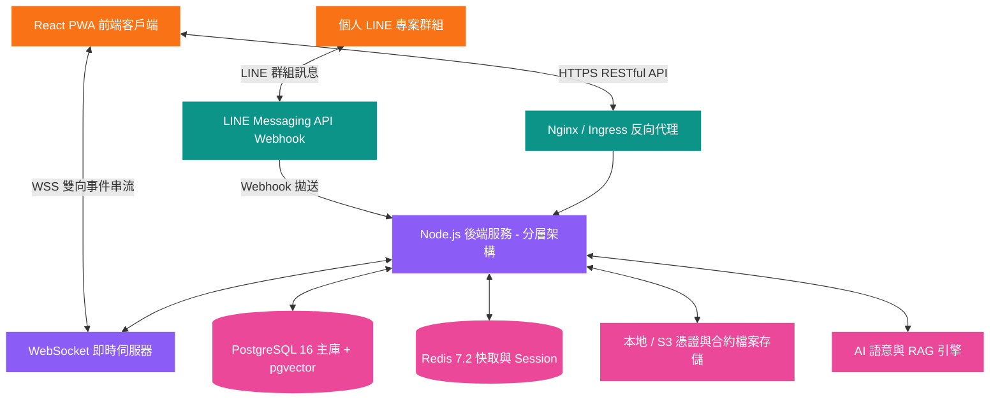

# 系統設計文檔 (SDD) - 立衡軟體開發專案與營運管理內部系統

> **文件說明**: 本文件定義立衡軟體開發專案與營運管理內部系統之完整技術架構、資料庫存取層選型 (Drizzle ORM + 原生 pg)、PostgreSQL 表結構字典與完整 SQL DDL 腳本、Redis 7.2 快取與原子計數規格、前端與後端代碼撰寫架構規範 (Hooks, CSS Tokens, Types, Services, Controllers, Repositories)、RESTful API 完整規格、WebSocket 即時事件架構、單元測試與整合測試規格 (Vitest, React Testing Library, Supertest)、資安防護與 Docker 多階段容器化規範，為工程開發之**單一事實來源 (Single Source of Truth, SSOT)**。

---

## 0. 文件修訂紀錄 (Revision History)

| 版本 | 修訂日期 | 修訂者 | 變更說明 / 摘要 | 審核狀態 |
| :---: | :---: | :---: | :--- | :---: |
| v1.0.0 | 2026-08-14 | Arch Team | 初稿建立：定義系統總體技術架構、RESTful API 清冊與 Docker 配置。 | 待審核 |
| v1.0.1 | 2026-08-14 | Arch Team | 規格全量融合與深度擴充：明確 Drizzle ORM、Redis 7.2 快取規格、12 張表結構字典與前後端代碼架構。 | 待審核 |
| v1.0.2 | 2026-08-14 | Arch Team | 補齊測試架構規格：新增第 9 章「單元測試與整合測試規格」，包含 Vitest 前後端測試框架、覆蓋率標準 (85%)、測試目錄規範與具體測試代碼撰寫範例 (Hook測試、毛利計算單元測試、API整合測試、Redis並發測試)。 | 待審核 |

---

## 1. 系統架構與技術選型 (System Architecture & Tech Stack)

### 1.1 技術選型表 (Technology Stack)

| 架構層級 (Layer) | 採用技術 (Technology) | 選型原因與設計考量 |
| :--- | :--- | :--- |
| **前端應用 (Frontend)** | React 18+ / TypeScript / Vite | 現代高響應單頁應用，建構速度快，生態豐富 |
| **UI 組件庫** | `@kawawei/frontend-modules` | 基於 Web Components 與 Shadow DOM 封裝之 CaaS 模組，零侵入性集成 |
| **行動與離線支援** | PWA (Service Worker + Web Manifest) | 支援 RWD 自適應排版與手機/平板桌面安裝運行 |
| **狀態與 URL 管理** | Zustand / TanStack Query | URL Query 雙向綁定 (標籤頁不重置) 與快取同步 |
| **後端服務 (Backend)** | Node.js (TypeScript) / Fastify | 輕量高效、非同步 I/O 表現優異，提供強型別 API |
| **後端架構解耦** | 分層架構 (Controller -> Service -> Repository) | 業務邏輯與傳輸層高度解耦，保留未來無縫替換為 Go/Rust 之彈性 |
| **資料庫存取層 (ORM)**| **Drizzle ORM + 原生 `pg` Pool** | 1. 具備極致的 TypeScript 型別安全與自動補全。<br>2. 零運行時開銷 (Zero-overhead)，效能接近原生 SQL。<br>3. 原生支援 PostgreSQL 與 `pgvector` 向量擴充。<br>4. 自動化 Migration 工具 (`drizzle-kit`)。<br>5. 透過 Repository 模式隔離，未來切換後端引擎時業務邏輯零修改。 |
| **即時通訊 (Realtime)** | WebSocket (ws / Socket.io) | 全量資料更新即時推播，前端免整頁刷新 |
| **主資料庫 (Database)**| PostgreSQL 16 + `pgvector` 擴充 | 強大關聯式事務處理、原生 JSONB 支援與高維向量相似度搜尋 |
| **快取與記憶體資料庫** | **Redis 7.2 (Alpine)** | 單號原子計數 (Atomic Counter)、8h Token 撤銷黑名單、WS 在線路由、API 限流 |
| **測試框架 (Testing)** | **Vitest + RTL + Supertest** | 快速執行單元測試、React 組件測試與 RESTful API 整合測試 |
| **套件管理 (Package)** | pnpm | 高效硬連結快取、嚴格依賴隔離，適合 Monorepo/模組化管理 |
| **容器化 (DevOps)** | Docker (Multi-stage Build) + Docker Compose | 區分本地開發與生產環境，本地支援 Volume 熱重載 (Hot Reload) |

---

### 1.2 系統整體架構圖 (System Architecture Diagram)



---

## 2. 安全規格與認證設計 (Security Specification)

依據 OWASP ASVS 規範，系統強制執行以下安全準則：

### 2.1 身份認證與 8 小時 Token 過期機制
* **認證方式**: HTTP Authorization Header (`Bearer <JWT>`)。
* **JWT 規格**: 
  * 演算法: `HS256` 或 `RS256`。
  * 效期: **8 小時 (`28800s`)**。
  * Payload: `{ sub: user_id, username, role, jti: uuid }`。
* **撤銷機制 (Revocation)**: 使用者登出時，將 `jti` 寫入 Redis 黑名單 (`auth:blacklist:{jti}`)，TTL 設為剩餘效期。
* **過期前端自動處理**:
  1. Axios 攔截器攔截 401 錯誤，自動清除 localStorage 並跳轉 `/login`。
  2. 前端定時器 (Timer) 監控 Token 剩餘時間，過期自動跳轉登入頁，**無需用戶手動刷新**。

### 2.2 角色權限矩陣 (RBAC Matrix)

| 功能模組 / 資源 (Resource) | 超級管理員 (Super Admin) | 工程師 (Engineer) |
| :--- | :---: | :---: |
| `POST /api/v1/auth/login` | 允許 | 允許 |
| `GET /api/v1/clients` | 完整檢視 | 僅檢視被指派專案之客戶 |
| `POST/PUT /api/v1/clients` | 允許 | 禁止 (403) |
| `GET /api/v1/contracts` | 完整檢視 | 僅檢視被指派專案之合約 |
| `POST/PUT /api/v1/contracts` | 允許 | 禁止 (403) |
| `GET /api/v1/projects` | 完整檢視 | 僅檢視被指派之專案 |
| `POST /api/v1/projects` | 允許 | 禁止 (403) |
| `POST /api/v1/projects/:id/progress-logs` | 允許 | 允許 (被指派專案) |
| `POST /api/v1/projects/:id/qa-issues` | 允許 | 允許 (被指派專案) |
| `GET /api/v1/finance/*` (收支與收款) | 完整檢視與操作 | 禁止 (403 攔截並隱藏選單) |
| `POST /api/v1/finance/expenses` | 允許審核與建立 | 允許提報支出 |
| `POST /api/v1/ai/semantic-search` | 完整檢索 | 允許檢索 |

---

## 3. Redis 快取與 Session 規格設計 (Redis Specification)

系統採用 **Redis 7.2** 作為高速記憶體儲存，所有 Key 一律採用 `模組:實體:識別碼` 的層級命名格式：

### 3.1 Redis Key 命名與 TTL 規範

| 應用場景 (Use Case) | Key 格式命名 (Key Pattern) | 資料型別 (Data Type) | TTL 效期 | 功能說明與操作機制 |
| :--- | :--- | :---: | :---: | :--- |
| **業務單號原子計數** | `code:seq:{prefix}:{YYYYMMDD}` | String (Integer) | 48 小時 (`172800s`) | 透過 Redis `INCR` 實現高並發下單號唯一不重複發號 (例: `code:seq:PJ:20260814`) |
| **8h Token 撤銷黑名單**| `auth:blacklist:{token_jti}` | String | 8 小時 (`28800s`) | 使用者主動登出或被踢除時將 Token 寫入黑名單，API 攔截器即時校驗 |
| **WebSocket 在線路由** | `ws:user:{user_id}:sessions` | Set | 無 (連線中維持) | 記錄該使用者目前開啟的 WebSocket 連線 Session ID 集合 |
| **專案 LINE 即時房間** | `ws:project:{project_id}:clients`| Set | 無 (連線中維持) | 記錄目前正在檢視該專案 LINE 動態的前端連線，用於局部推播 |
| **API 限流防護** | `ratelimit:ip:{ip_address}` | String (Counter) | 60 秒 (`60s`) | 限制單一 IP 於 1 分鐘內最多發起 120 次請求 (防爬蟲與暴破) |
| **熱點資料快取** | `cache:client:{client_id}` | String (JSON) | 5 分鐘 (`300s`) | 客戶詳情快取，當資料更新時透過 Repository 自動執行 `DEL` 失效 |

---

## 4. 資料庫完整表結構字典規格 (Database Data Dictionary)

所有資料表一律採用小寫 `snake_case`，必備 `id` (PK), `created_at`, `updated_at`, `deleted_at` (軟刪除)：

### 4.1 使用者與帳號表 (`users`)

| 欄位名稱 (Field) | 資料型別 (Type) | PK/FK | 允許空 (Null) | 預設值 (Default) | 說明與約束 (Description & Constraints) |
| :--- | :--- | :---: | :---: | :--- | :--- |
| `id` | UUID | PK | 否 | `uuid_generate_v4()` | 使用者唯一識別碼 |
| `username` | VARCHAR(50) | - | 否 | - | 登入帳號 (唯一索引 UNIQUE) |
| `password_hash` | VARCHAR(255) | - | 否 | - | BCrypt 加鹽雜湊密碼 |
| `real_name` | VARCHAR(50) | - | 否 | - | 使用者真實姓名 |
| `role` | VARCHAR(20) | - | 否 | `'engineer'` | 系統角色: `super_admin`, `engineer` |
| `is_active` | BOOLEAN | - | 否 | `true` | 帳號啟用狀態 |
| `created_at` | TIMESTAMPTZ | - | 否 | `CURRENT_TIMESTAMP` | 建立時間戳 |
| `updated_at` | TIMESTAMPTZ | - | 否 | `CURRENT_TIMESTAMP` | 更新時間戳 |
| `deleted_at` | TIMESTAMPTZ | - | 是 | `NULL` | 軟刪除時間戳 (NULL 表示未刪除) |

---

### 4.2 客戶主表 (`clients`)

| 欄位名稱 (Field) | 資料型別 (Type) | PK/FK | 允許空 (Null) | 預設值 (Default) | 說明與約束 (Description & Constraints) |
| :--- | :--- | :---: | :---: | :--- | :--- |
| `id` | UUID | PK | 否 | `uuid_generate_v4()` | 客戶唯一識別碼 |
| `name` | VARCHAR(100) | - | 否 | - | 公司名稱 / 客戶名稱 |
| `tax_id` | VARCHAR(8) | - | 是 | `NULL` | 統一編號 (8 碼數字，建立條件索引) |
| `category` | VARCHAR(20) | - | 否 | `'lead'` | 分類: `lead` (潛在), `client` (正式), `archived` (結案) |
| `status` | VARCHAR(20) | - | 否 | `'pending'` | 追蹤狀態: `pending`, `in_progress`, `quoted`, `signed`, `delivered`, `lost` |
| `contact_name` | VARCHAR(50) | - | 否 | - | 主要聯絡人姓名 |
| `contact_title`| VARCHAR(50) | - | 是 | `NULL` | 聯絡人職稱 |
| `phone` | VARCHAR(30) | - | 否 | - | 聯絡電話 / 手機 |
| `email` | VARCHAR(100) | - | 是 | `NULL` | 電子郵件 |
| `line_id` | VARCHAR(50) | - | 是 | `NULL` | LINE ID / WeChat ID |
| `tags` | TEXT[] | - | 否 | `'{}'` | 標籤陣列 (如: `['老客戶', 'AI專案']`) |
| `address` | VARCHAR(200) | - | 是 | `NULL` | 公司地址 |
| `notes` | TEXT | - | 是 | `NULL` | 客戶備註說明 |
| `created_at` | TIMESTAMPTZ | - | 否 | `CURRENT_TIMESTAMP` | 建立時間 |
| `updated_at` | TIMESTAMPTZ | - | 否 | `CURRENT_TIMESTAMP` | 更新時間 |
| `deleted_at` | TIMESTAMPTZ | - | 是 | `NULL` | 軟刪除時間 |

---

### 4.3 客戶跟進活動紀錄表 (`client_activity_logs`)

| 欄位名稱 (Field) | 資料型別 (Type) | PK/FK | 允許空 (Null) | 預設值 (Default) | 說明與約束 |
| :--- | :--- | :---: | :---: | :--- | :--- |
| `id` | UUID | PK | 否 | `uuid_generate_v4()` | 跟進紀錄唯一識別碼 |
| `client_id` | UUID | FK | 否 | - | 關聯客戶 ID (外鍵 `clients.id`) |
| `user_id` | UUID | FK | 否 | - | 填寫業務/人員 ID (外鍵 `users.id`) |
| `activity_date`| DATE | - | 否 | - | 聯繫活動日期 |
| `contact_type` | VARCHAR(30) | - | 否 | - | 聯繫方式: `meeting`, `phone`, `visit`, `line_msg` |
| `content` | TEXT | - | 否 | - | 溝通要點內容 |
| `next_action` | TEXT | - | 是 | `NULL` | 下次待辦事項 |
| `next_remind_date`| DATE | - | 是 | `NULL` | 下次提醒追蹤日期 |
| `created_at` | TIMESTAMPTZ | - | 否 | `CURRENT_TIMESTAMP` | 建立時間 |
| `updated_at` | TIMESTAMPTZ | - | 否 | `CURRENT_TIMESTAMP` | 更新時間 |
| `deleted_at` | TIMESTAMPTZ | - | 是 | `NULL` | 軟刪除時間 |

---

### 4.4 合約與報價單表 (`contracts`)

| 欄位名稱 (Field) | 資料型別 (Type) | PK/FK | 允許空 (Null) | 預設值 (Default) | 說明與約束 |
| :--- | :--- | :---: | :---: | :--- | :--- |
| `id` | UUID | PK | 否 | `uuid_generate_v4()` | 合約識別碼 |
| `code` | VARCHAR(50) | - | 否 | - | 單號 (唯一索引): `QT-YYYYMMDD-XXXX`, `CT-YYYYMMDD-XXXX` |
| `type` | VARCHAR(20) | - | 否 | - | 類型: `quotation`, `contract`, `maintenance` |
| `title` | VARCHAR(150) | - | 否 | - | 合約/報價單主題名稱 |
| `client_id` | UUID | FK | 否 | - | 關聯客戶 ID (外鍵 `clients.id`) |
| `amount_untaxed`| NUMERIC(14,2)| - | 否 | `0.00` | 未稅金額 |
| `tax_rate` | NUMERIC(5,2) | - | 否 | `5.00` | 營業稅率 (%) |
| `amount_taxed` | NUMERIC(14,2)| - | 否 | `0.00` | 含稅總額 (公式計算) |
| `status` | VARCHAR(20) | - | 否 | `'negotiating'`| 狀態: `negotiating`, `pending_sign`, `signed`, `closed`, `void` |
| `start_date` | DATE | - | 是 | `NULL` | 合約生效日 |
| `end_date` | DATE | - | 是 | `NULL` | 合約到期日 |
| `attachment_url`| VARCHAR(255)| - | 是 | `NULL` | 合約 PDF / 報價單附件儲存路徑 |
| `notes` | TEXT | - | 是 | `NULL` | 付款條件與備註說明 |
| `created_at` | TIMESTAMPTZ | - | 否 | `CURRENT_TIMESTAMP` | 建立時間 |
| `updated_at` | TIMESTAMPTZ | - | 否 | `CURRENT_TIMESTAMP` | 更新時間 |
| `deleted_at` | TIMESTAMPTZ | - | 是 | `NULL` | 軟刪除時間 |

---

### 4.5 專案主表 (`projects`)

| 欄位名稱 (Field) | 資料型別 (Type) | PK/FK | 允許空 (Null) | 預設值 (Default) | 說明與約束 |
| :--- | :--- | :---: | :---: | :--- | :--- |
| `id` | UUID | PK | 否 | `uuid_generate_v4()` | 專案唯一識別碼 |
| `code` | VARCHAR(50) | - | 否 | - | 專案案號 (唯一索引): `PJ-YYYYMMDD-XXXX` |
| `name` | VARCHAR(150) | - | 否 | - | 專案名稱 |
| `client_id` | UUID | FK | 否 | - | 關聯客戶 ID (外鍵 `clients.id`) |
| `contract_id` | UUID | FK | 是 | `NULL` | 關聯合約 ID (外鍵 `contracts.id`) |
| `stage` | VARCHAR(30) | - | 否 | `'proposal'` | 階段: `proposal`, `spec`, `dev`, `qa`, `delivery`, `running`, `closed` |
| `progress_rate`| INT | - | 否 | `0` | 進度百分比 (0 ~ 100) |
| `health_status`| VARCHAR(20) | - | 否 | `'normal'` | 運行健康度: `normal`, `warning`, `error` |
| `server_url` | VARCHAR(255) | - | 是 | `NULL` | 線上測試/正式伺服器網址 |
| `start_date` | DATE | - | 是 | `NULL` | 預計起始日期 |
| `end_date` | DATE | - | 是 | `NULL` | 預計交付日期 |
| `assigned_engineer_ids` | UUID[] | - | 否 | `'{}'` | 指派負責工程師 ID 陣列 |
| `created_at` | TIMESTAMPTZ | - | 否 | `CURRENT_TIMESTAMP` | 建立時間 |
| `updated_at` | TIMESTAMPTZ | - | 否 | `CURRENT_TIMESTAMP` | 更新時間 |
| `deleted_at` | TIMESTAMPTZ | - | 是 | `NULL` | 軟刪除時間 |

---

### 4.6 專案里程碑與進度日誌表 (`project_milestones`, `project_progress_logs`)

#### `project_milestones` (專案里程碑)
| 欄位名稱 (Field) | 資料型別 (Type) | PK/FK | 允許空 (Null) | 預設值 (Default) | 說明與約束 |
| :--- | :--- | :---: | :---: | :--- | :--- |
| `id` | UUID | PK | 否 | `uuid_generate_v4()` | 里程碑識別碼 |
| `project_id` | UUID | FK | 否 | - | 關聯專案 ID (外鍵 `projects.id`) |
| `name` | VARCHAR(100) | - | 否 | - | 里程碑節點名稱 |
| `due_date` | DATE | - | 是 | `NULL` | 預計完成日期 |
| `is_completed` | BOOLEAN | - | 否 | `false` | 是否已完成驗收 |
| `weight` | INT | - | 否 | `0` | 權重百分比 |
| `created_at` | TIMESTAMPTZ | - | 否 | `CURRENT_TIMESTAMP` | 建立時間 |
| `updated_at` | TIMESTAMPTZ | - | 否 | `CURRENT_TIMESTAMP` | 更新時間 |
| `deleted_at` | TIMESTAMPTZ | - | 是 | `NULL` | 軟刪除時間 |

#### `project_progress_logs` (工程師進度日誌)
| 欄位名稱 (Field) | 資料型別 (Type) | PK/FK | 允許空 (Null) | 預設值 (Default) | 說明與約束 |
| :--- | :--- | :---: | :---: | :--- | :--- |
| `id` | UUID | PK | 否 | `uuid_generate_v4()` | 日誌唯一識別碼 |
| `project_id` | UUID | FK | 否 | - | 關聯專案 ID (外鍵 `projects.id`) |
| `user_id` | UUID | FK | 否 | - | 填寫工程師 ID (外鍵 `users.id`) |
| `log_date` | DATE | - | 否 | - | 日誌回報日期 |
| `completed_work`| TEXT | - | 否 | - | 本期完成工作明細 |
| `in_progress_work`| TEXT | - | 否 | - | 進行中工作明細 |
| `blockers` | TEXT | - | 是 | `NULL` | 遭遇技術/時程阻礙 |
| `created_at` | TIMESTAMPTZ | - | 否 | `CURRENT_TIMESTAMP` | 建立時間 |
| `updated_at` | TIMESTAMPTZ | - | 否 | `CURRENT_TIMESTAMP` | 更新時間 |
| `deleted_at` | TIMESTAMPTZ | - | 是 | `NULL` | 軟刪除時間 |

---

### 4.7 專案 QA Bug 缺陷表 (`project_qa_issues`)

| 欄位名稱 (Field) | 資料型別 (Type) | PK/FK | 允許空 (Null) | 預設值 (Default) | 說明與約束 |
| :--- | :--- | :---: | :---: | :--- | :--- |
| `id` | UUID | PK | 否 | `uuid_generate_v4()` | 缺陷識別碼 |
| `project_id` | UUID | FK | 否 | - | 關聯專案 ID (外鍵 `projects.id`) |
| `title` | VARCHAR(150) | - | 否 | - | 缺陷標題 |
| `severity` | VARCHAR(20) | - | 否 | `'minor'` | 嚴重等級: `critical`, `major`, `minor` |
| `status` | VARCHAR(20) | - | 否 | `'open'` | 修復狀態: `open`, `in_progress`, `fixed`, `verified` |
| `assigned_user_id`| UUID | FK | 是 | `NULL` | 指派修復工程師 (外鍵 `users.id`) |
| `description` | TEXT | - | 是 | `NULL` | 重現步驟與異常說明 |
| `created_at` | TIMESTAMPTZ | - | 否 | `CURRENT_TIMESTAMP` | 建立時間 |
| `updated_at` | TIMESTAMPTZ | - | 否 | `CURRENT_TIMESTAMP` | 更新時間 |
| `deleted_at` | TIMESTAMPTZ | - | 是 | `NULL` | 軟刪除時間 |

---

### 4.8 公司銀行帳戶表 (`bank_accounts`)

| 欄位名稱 (Field) | 資料型別 (Type) | PK/FK | 允許空 (Null) | 預設值 (Default) | 說明與約束 |
| :--- | :--- | :---: | :---: | :--- | :--- |
| `id` | UUID | PK | 否 | `uuid_generate_v4()` | 銀行帳戶識別碼 |
| `bank_code` | VARCHAR(10) | - | 否 | - | 銀行總行代碼 (如 `012`) |
| `bank_name` | VARCHAR(50) | - | 否 | - | 銀行名稱 (如 台北富邦銀行) |
| `branch_name` | VARCHAR(50) | - | 是 | `NULL` | 分行名稱 |
| `account_number`| VARCHAR(30) | - | 否 | - | 帳號 (唯一索引 UNIQUE) |
| `account_name` | VARCHAR(100) | - | 否 | - | 戶名 (如 立衡科技有限公司) |
| `usage_desc` | VARCHAR(100) | - | 是 | `NULL` | 用途說明 (主要營業帳戶/外匯帳戶) |
| `created_at` | TIMESTAMPTZ | - | 否 | `CURRENT_TIMESTAMP` | 建立時間 |
| `updated_at` | TIMESTAMPTZ | - | 否 | `CURRENT_TIMESTAMP` | 更新時間 |
| `deleted_at` | TIMESTAMPTZ | - | 是 | `NULL` | 軟刪除時間 |

---

### 4.9 財務收款表 (`finance_receivables`)

| 欄位名稱 (Field) | 資料型別 (Type) | PK/FK | 允許空 (Null) | 預設值 (Default) | 說明與約束 |
| :--- | :--- | :---: | :---: | :--- | :--- |
| `id` | UUID | PK | 否 | `uuid_generate_v4()` | 收款期程識別碼 |
| `code` | VARCHAR(50) | - | 否 | - | 收款單號 (唯一索引): `REC-YYYYMMDD-XXXX` |
| `project_id` | UUID | FK | 否 | - | 關聯專案 ID (外鍵 `projects.id`) |
| `stage_name` | VARCHAR(100) | - | 否 | - | 階段名稱 (如: 訂金 30%, 驗收款 30%) |
| `expected_date`| DATE | - | 否 | - | 預計請款日期 |
| `amount_untaxed`| NUMERIC(14,2)| - | 否 | - | 未稅金額 |
| `amount_taxed` | NUMERIC(14,2)| - | 否 | - | 含稅金額 |
| `status` | VARCHAR(20) | - | 否 | `'pending_invoice'` | 狀態: `pending_invoice`, `invoiced`, `received`, `overdue` |
| `invoice_date` | DATE | - | 是 | `NULL` | 發票開立日期 |
| `invoice_number`| VARCHAR(30) | - | 是 | `NULL` | 發票號碼 (`^[A-Z]{2}-\d{8}$`) |
| `invoice_notes` | TEXT | - | 是 | `NULL` | 發票備註 |
| `received_date`| DATE | - | 是 | `NULL` | 實際入帳日期 |
| `received_amount`| NUMERIC(14,2)| - | 否 | `0.00` | 實際入帳金額 |
| `bank_account_id`| UUID | FK | 是 | `NULL` | 入帳銀行帳戶 (外鍵 `bank_accounts.id`) |
| `created_at` | TIMESTAMPTZ | - | 否 | `CURRENT_TIMESTAMP` | 建立時間 |
| `updated_at` | TIMESTAMPTZ | - | 否 | `CURRENT_TIMESTAMP` | 更新時間 |
| `deleted_at` | TIMESTAMPTZ | - | 是 | `NULL` | 軟刪除時間 |

---

### 4.10 財務支出表 (`finance_expenses`)

| 欄位名稱 (Field) | 資料型別 (Type) | PK/FK | 允許空 (Null) | 預設值 (Default) | 說明與約束 |
| :--- | :--- | :---: | :---: | :--- | :--- |
| `id` | UUID | PK | 否 | `uuid_generate_v4()` | 支出單唯一識別碼 |
| `code` | VARCHAR(50) | - | 否 | - | 支出單號 (唯一索引): `EXP-YYYYMMDD-XXXX` |
| `name` | VARCHAR(150) | - | 否 | - | 支出名稱 (如 AWS 主機費) |
| `expense_date` | DATE | - | 否 | - | 支出日期 |
| `category` | VARCHAR(30) | - | 否 | - | 類別: `server`, `api_service`, `outsource`, `overhead`, `other` |
| `is_project_specific`| BOOLEAN | - | 否 | `true` | 是否為專案專屬 (false 為公司共用) |
| `project_id` | UUID | FK | 是 | `NULL` | 歸屬專案 ID (公司支出時為 NULL) |
| `amount_untaxed`| NUMERIC(14,2)| - | 否 | - | 未稅金額 |
| `amount_taxed` | NUMERIC(14,2)| - | 否 | - | 含稅金額 |
| `vendor_name` | VARCHAR(100) | - | 是 | `NULL` | 供應商名稱 (如 Amazon Web Services) |
| `invoice_number`| VARCHAR(50) | - | 是 | `NULL` | 憑證/發票號碼 |
| `receipt_attachment_url`| VARCHAR(255)| - | 是 | `NULL` | 憑證附件圖檔/PDF 路徑 |
| `bank_account_id`| UUID | FK | 是 | `NULL` | 支出之公司銀行帳戶 ID |
| `payment_status`| VARCHAR(20) | - | 否 | `'pending'` | 狀態: `pending` (待付款), `paid` (已付款) |
| `created_at` | TIMESTAMPTZ | - | 否 | `CURRENT_TIMESTAMP` | 建立時間 |
| `updated_at` | TIMESTAMPTZ | - | 否 | `CURRENT_TIMESTAMP` | 更新時間 |
| `deleted_at` | TIMESTAMPTZ | - | 是 | `NULL` | 軟刪除時間 |

---

### 4.11 LINE 專案群組與訊息表 (`project_line_bindings`, `project_line_messages`)

#### `project_line_bindings` (專案 LINE 群組綁定)
| 欄位名稱 (Field) | 資料型別 (Type) | PK/FK | 允許空 (Null) | 預設值 (Default) | 說明與約束 |
| :--- | :--- | :---: | :---: | :--- | :--- |
| `id` | UUID | PK | 否 | `uuid_generate_v4()` | 綁定識別碼 |
| `project_id` | UUID | FK | 否 | - | 關聯專案 ID (唯一索引 UNIQUE) |
| `line_group_id`| VARCHAR(100) | - | 否 | - | LINE 群組代碼 (唯一索引 UNIQUE) |
| `line_group_name`| VARCHAR(100)| - | 是 | `NULL` | LINE 群組名稱 |
| `is_active` | BOOLEAN | - | 否 | `true` | 是否啟用監聽 |
| `created_at` | TIMESTAMPTZ | - | 否 | `CURRENT_TIMESTAMP` | 建立時間 |
| `updated_at` | TIMESTAMPTZ | - | 否 | `CURRENT_TIMESTAMP` | 更新時間 |
| `deleted_at` | TIMESTAMPTZ | - | 是 | `NULL` | 軟刪除時間 |

#### `project_line_messages` (LINE 訊息串流歷程)
| 欄位名稱 (Field) | 資料型別 (Type) | PK/FK | 允許空 (Null) | 預設值 (Default) | 說明與約束 |
| :--- | :--- | :---: | :---: | :--- | :--- |
| `id` | UUID | PK | 否 | `uuid_generate_v4()` | 訊息識別碼 |
| `project_id` | UUID | FK | 否 | - | 關聯專案 ID (外鍵 `projects.id`) |
| `line_group_id`| VARCHAR(100) | - | 否 | - | LINE 群組代碼 |
| `sender_id` | VARCHAR(100) | - | 否 | - | 發言者 LINE UserID |
| `sender_name` | VARCHAR(100) | - | 否 | - | 發言者 LINE 暱稱 |
| `sender_avatar_url`| VARCHAR(255)| - | 是 | `NULL` | 發言者頭像 URL |
| `message_type` | VARCHAR(20) | - | 否 | `'text'` | 類型: `text`, `image`, `file`, `system` |
| `message_text` | TEXT | - | 是 | `NULL` | 訊息內容 |
| `created_at` | TIMESTAMPTZ | - | 否 | `CURRENT_TIMESTAMP` | 發送時間 |

---

### 4.12 全局向量語意索引表 (`embedding_vectors`)

| 欄位名稱 (Field) | 資料型別 (Type) | PK/FK | 允許空 (Null) | 預設值 (Default) | 說明與約束 |
| :--- | :--- | :---: | :---: | :--- | :--- |
| `id` | UUID | PK | 否 | `uuid_generate_v4()` | 向量紀錄識別碼 |
| `source_type` | VARCHAR(30) | - | 否 | - | 來源: `client`, `contract`, `project`, `progress_log`, `line_message` |
| `source_id` | UUID | - | 否 | - | 關聯原始單據 ID |
| `content_text` | TEXT | - | 否 | - | 向量化之原始文字內容 |
| `embedding` | vector(1536) | - | 否 | - | 1536 維度 Embeddings (建立 IVFFlat 餘弦相似度索引) |
| `created_at` | TIMESTAMPTZ | - | 否 | `CURRENT_TIMESTAMP` | 建立時間 |

---

### 4.13 完整 PostgreSQL SQL DDL 腳本

```sql
-- 啟用擴充套件
CREATE EXTENSION IF NOT EXISTS "uuid-ossp";
CREATE EXTENSION IF NOT EXISTS "vector";

-- 1. 使用者與帳號表 (Users)
CREATE TABLE users (
    id UUID PRIMARY KEY DEFAULT uuid_generate_v4(),
    username VARCHAR(50) NOT NULL UNIQUE,
    password_hash VARCHAR(255) NOT NULL,
    real_name VARCHAR(50) NOT NULL,
    role VARCHAR(20) NOT NULL DEFAULT 'engineer',
    is_active BOOLEAN NOT NULL DEFAULT true,
    created_at TIMESTAMPTZ DEFAULT CURRENT_TIMESTAMP,
    updated_at TIMESTAMPTZ DEFAULT CURRENT_TIMESTAMP,
    deleted_at TIMESTAMPTZ
);

-- 2. 客戶資料表 (Clients)
CREATE TABLE clients (
    id UUID PRIMARY KEY DEFAULT uuid_generate_v4(),
    name VARCHAR(100) NOT NULL,
    tax_id VARCHAR(8),
    category VARCHAR(20) NOT NULL DEFAULT 'lead',
    status VARCHAR(20) NOT NULL DEFAULT 'pending',
    contact_name VARCHAR(50) NOT NULL,
    contact_title VARCHAR(50),
    phone VARCHAR(30) NOT NULL,
    email VARCHAR(100),
    line_id VARCHAR(50),
    tags TEXT[] DEFAULT '{}',
    address VARCHAR(200),
    notes TEXT,
    created_at TIMESTAMPTZ DEFAULT CURRENT_TIMESTAMP,
    updated_at TIMESTAMPTZ DEFAULT CURRENT_TIMESTAMP,
    deleted_at TIMESTAMPTZ
);
CREATE INDEX idx_clients_tax_id ON clients(tax_id) WHERE deleted_at IS NULL;
CREATE INDEX idx_clients_status ON clients(status) WHERE deleted_at IS NULL;

-- 3. 客戶跟進活動紀錄 (Client Activity Logs)
CREATE TABLE client_activity_logs (
    id UUID PRIMARY KEY DEFAULT uuid_generate_v4(),
    client_id UUID NOT NULL REFERENCES clients(id),
    user_id UUID NOT NULL REFERENCES users(id),
    activity_date DATE NOT NULL,
    contact_type VARCHAR(30) NOT NULL,
    content TEXT NOT NULL,
    next_action TEXT,
    next_remind_date DATE,
    created_at TIMESTAMPTZ DEFAULT CURRENT_TIMESTAMP,
    updated_at TIMESTAMPTZ DEFAULT CURRENT_TIMESTAMP,
    deleted_at TIMESTAMPTZ
);

-- 4. 合約與報價單表 (Contracts & Quotations)
CREATE TABLE contracts (
    id UUID PRIMARY KEY DEFAULT uuid_generate_v4(),
    code VARCHAR(50) NOT NULL UNIQUE,
    type VARCHAR(20) NOT NULL,
    title VARCHAR(150) NOT NULL,
    client_id UUID NOT NULL REFERENCES clients(id),
    amount_untaxed NUMERIC(14, 2) NOT NULL DEFAULT 0.00,
    tax_rate NUMERIC(5, 2) NOT NULL DEFAULT 5.00,
    amount_taxed NUMERIC(14, 2) NOT NULL DEFAULT 0.00,
    status VARCHAR(20) NOT NULL DEFAULT 'negotiating',
    start_date DATE,
    end_date DATE,
    attachment_url VARCHAR(255),
    notes TEXT,
    created_at TIMESTAMPTZ DEFAULT CURRENT_TIMESTAMP,
    updated_at TIMESTAMPTZ DEFAULT CURRENT_TIMESTAMP,
    deleted_at TIMESTAMPTZ
);

-- 5. 專案主表 (Projects)
CREATE TABLE projects (
    id UUID PRIMARY KEY DEFAULT uuid_generate_v4(),
    code VARCHAR(50) NOT NULL UNIQUE,
    name VARCHAR(150) NOT NULL,
    client_id UUID NOT NULL REFERENCES clients(id),
    contract_id UUID REFERENCES contracts(id),
    stage VARCHAR(30) NOT NULL DEFAULT 'proposal',
    progress_rate INT NOT NULL DEFAULT 0,
    health_status VARCHAR(20) NOT NULL DEFAULT 'normal',
    server_url VARCHAR(255),
    start_date DATE,
    end_date DATE,
    assigned_engineer_ids UUID[] DEFAULT '{}',
    created_at TIMESTAMPTZ DEFAULT CURRENT_TIMESTAMP,
    updated_at TIMESTAMPTZ DEFAULT CURRENT_TIMESTAMP,
    deleted_at TIMESTAMPTZ
);

-- 6. 專案里程碑與進度日誌 (Milestones & Progress Logs)
CREATE TABLE project_milestones (
    id UUID PRIMARY KEY DEFAULT uuid_generate_v4(),
    project_id UUID NOT NULL REFERENCES projects(id),
    name VARCHAR(100) NOT NULL,
    due_date DATE,
    is_completed BOOLEAN NOT NULL DEFAULT false,
    weight INT NOT NULL DEFAULT 0,
    created_at TIMESTAMPTZ DEFAULT CURRENT_TIMESTAMP,
    updated_at TIMESTAMPTZ DEFAULT CURRENT_TIMESTAMP,
    deleted_at TIMESTAMPTZ
);

CREATE TABLE project_progress_logs (
    id UUID PRIMARY KEY DEFAULT uuid_generate_v4(),
    project_id UUID NOT NULL REFERENCES projects(id),
    user_id UUID NOT NULL REFERENCES users(id),
    log_date DATE NOT NULL,
    completed_work TEXT NOT NULL,
    in_progress_work TEXT NOT NULL,
    blockers TEXT,
    created_at TIMESTAMPTZ DEFAULT CURRENT_TIMESTAMP,
    updated_at TIMESTAMPTZ DEFAULT CURRENT_TIMESTAMP,
    deleted_at TIMESTAMPTZ
);

-- 7. 專案 QA Bug 與運行監控表 (QA Issues)
CREATE TABLE project_qa_issues (
    id UUID PRIMARY KEY DEFAULT uuid_generate_v4(),
    project_id UUID NOT NULL REFERENCES projects(id),
    title VARCHAR(150) NOT NULL,
    severity VARCHAR(20) NOT NULL DEFAULT 'minor',
    status VARCHAR(20) NOT NULL DEFAULT 'open',
    assigned_user_id UUID REFERENCES users(id),
    description TEXT,
    created_at TIMESTAMPTZ DEFAULT CURRENT_TIMESTAMP,
    updated_at TIMESTAMPTZ DEFAULT CURRENT_TIMESTAMP,
    deleted_at TIMESTAMPTZ
);

-- 8. 公司銀行帳戶表 (Bank Accounts)
CREATE TABLE bank_accounts (
    id UUID PRIMARY KEY DEFAULT uuid_generate_v4(),
    bank_code VARCHAR(10) NOT NULL,
    bank_name VARCHAR(50) NOT NULL,
    branch_name VARCHAR(50),
    account_number VARCHAR(30) NOT NULL UNIQUE,
    account_name VARCHAR(100) NOT NULL,
    usage_desc VARCHAR(100),
    created_at TIMESTAMPTZ DEFAULT CURRENT_TIMESTAMP,
    updated_at TIMESTAMPTZ DEFAULT CURRENT_TIMESTAMP,
    deleted_at TIMESTAMPTZ
);

-- 9. 財務收款管理 (Receivables)
CREATE TABLE finance_receivables (
    id UUID PRIMARY KEY DEFAULT uuid_generate_v4(),
    code VARCHAR(50) NOT NULL UNIQUE,
    project_id UUID NOT NULL REFERENCES projects(id),
    stage_name VARCHAR(100) NOT NULL,
    expected_date DATE NOT NULL,
    amount_untaxed NUMERIC(14, 2) NOT NULL,
    amount_taxed NUMERIC(14, 2) NOT NULL,
    status VARCHAR(20) NOT NULL DEFAULT 'pending_invoice',
    invoice_date DATE,
    invoice_number VARCHAR(30),
    invoice_notes TEXT,
    received_date DATE,
    received_amount NUMERIC(14, 2) DEFAULT 0.00,
    bank_account_id UUID REFERENCES bank_accounts(id),
    created_at TIMESTAMPTZ DEFAULT CURRENT_TIMESTAMP,
    updated_at TIMESTAMPTZ DEFAULT CURRENT_TIMESTAMP,
    deleted_at TIMESTAMPTZ
);

-- 10. 專案與公司支出管理 (Expenses)
CREATE TABLE finance_expenses (
    id UUID PRIMARY KEY DEFAULT uuid_generate_v4(),
    code VARCHAR(50) NOT NULL UNIQUE,
    name VARCHAR(150) NOT NULL,
    expense_date DATE NOT NULL,
    category VARCHAR(30) NOT NULL,
    is_project_specific BOOLEAN NOT NULL DEFAULT true,
    project_id UUID REFERENCES projects(id),
    amount_untaxed NUMERIC(14, 2) NOT NULL,
    amount_taxed NUMERIC(14, 2) NOT NULL,
    vendor_name VARCHAR(100),
    invoice_number VARCHAR(50),
    receipt_attachment_url VARCHAR(255),
    bank_account_id UUID REFERENCES bank_accounts(id),
    payment_status VARCHAR(20) NOT NULL DEFAULT 'pending',
    created_at TIMESTAMPTZ DEFAULT CURRENT_TIMESTAMP,
    updated_at TIMESTAMPTZ DEFAULT CURRENT_TIMESTAMP,
    deleted_at TIMESTAMPTZ
);

-- 11. LINE 專案群組綁定與訊息串流 (LINE Group Sync)
CREATE TABLE project_line_bindings (
    id UUID PRIMARY KEY DEFAULT uuid_generate_v4(),
    project_id UUID NOT NULL UNIQUE REFERENCES projects(id),
    line_group_id VARCHAR(100) NOT NULL UNIQUE,
    line_group_name VARCHAR(100),
    is_active BOOLEAN NOT NULL DEFAULT true,
    created_at TIMESTAMPTZ DEFAULT CURRENT_TIMESTAMP,
    updated_at TIMESTAMPTZ DEFAULT CURRENT_TIMESTAMP,
    deleted_at TIMESTAMPTZ
);

CREATE TABLE project_line_messages (
    id UUID PRIMARY KEY DEFAULT uuid_generate_v4(),
    project_id UUID NOT NULL REFERENCES projects(id),
    line_group_id VARCHAR(100) NOT NULL,
    sender_id VARCHAR(100) NOT NULL,
    sender_name VARCHAR(100) NOT NULL,
    sender_avatar_url VARCHAR(255),
    message_type VARCHAR(20) NOT NULL DEFAULT 'text',
    message_text TEXT,
    created_at TIMESTAMPTZ DEFAULT CURRENT_TIMESTAMP
);

-- 12. 全局向量語意索引表 (Embedding Vectors)
CREATE TABLE embedding_vectors (
    id UUID PRIMARY KEY DEFAULT uuid_generate_v4(),
    source_type VARCHAR(30) NOT NULL,
    source_id UUID NOT NULL,
    content_text TEXT NOT NULL,
    embedding vector(1536) NOT NULL,
    created_at TIMESTAMPTZ DEFAULT CURRENT_TIMESTAMP
);
CREATE INDEX idx_embedding_vector ON embedding_vectors USING ivfflat (embedding vector_cosine_ops) WITH (lists = 100);
```

---

## 5. 前端代碼架構與模組設計 (Frontend Code Architecture)

前端代碼嚴格落實組件化，遵守三件套目錄標準 (`.tsx`, `.css`, `index.ts`)，使用 `@kawawei/frontend-modules` 組件庫，並透過自訂 Hooks 與 Types 實現高內聚低耦合。

### 5.1 前端目錄結構展開

```
frontend/src/
├── assets/                          # 靜態資源 (SVG 圖標、品牌標誌)
├── components/                      # 可重用 UI 組件庫
│   ├── icon/                        # 文字 Icon 標準組件 (sm: 16px, md: 20px, lg: 24px)
│   │   ├── TextIcon.tsx
│   │   ├── TextIcon.css
│   │   └── index.ts
│   ├── layout/                      # 佈局組件 (Header, Sidebar, ContentLayout)
│   │   ├── MainLayout.tsx
│   │   ├── MainLayout.css
│   │   └── index.ts
│   ├── status-badge/                # 狀態標籤組件
│   │   ├── StatusBadge.tsx
│   │   ├── StatusBadge.css
│   │   └── index.ts
│   └── feedback/                    # 全域 Toast 與確認彈窗 Modal
│       ├── ToastContainer.tsx
│       ├── ConfirmDialog.tsx
│       └── index.ts
├── hooks/                           # 自訂 React Hooks
│   ├── useUrlTabs.ts                # URL Query 雙向綁定 Tab 狀態 Hook
│   ├── useWebSocket.ts              # WebSocket 即時監聽與狀態同步 Hook
│   ├── useAuth.ts                   # 登入狀態與 8h Token 過期監聽 Hook
│   └── useDebounce.ts               # 輸入框防抖 Hook (用於搜尋)
├── pages/                           # 路由頁面模組 (Pages)
│   ├── login/
│   ├── dashboard/
│   ├── clients/
│   │   ├── ClientList.tsx
│   │   ├── ClientDetail.tsx
│   │   └── ClientModal.tsx
│   ├── contracts/
│   ├── projects/
│   │   ├── ProjectList.tsx
│   │   ├── ProjectDetail.tsx
│   │   └── tabs/                    # 專案 5 大 Tab 子頁面
│   │       ├── MilestoneTab.tsx
│   │       ├── ProgressLogTab.tsx
│   │       ├── QAMonitorTab.tsx
│   │       ├── LineSyncTab.tsx
│   │       └── FinanceTab.tsx
│   └── finance/
├── services/                        # API 請求與 Axios 封裝
│   ├── api-client.ts                # Axios 實例與 401 攔截器
│   ├── client-service.ts
│   ├── contract-service.ts
│   ├── project-service.ts
│   └── finance-service.ts
├── stores/                          # Zustand 全域狀態管理
│   ├── auth-store.ts
│   ├── client-store.ts
│   └── project-store.ts
├── styles/                          # CSS 變數與設計 Tokens
│   ├── tokens.css                   # 亮色主題色票、字級、間距、Icon 尺寸變數
│   └── global.css                   # 全域 Reset 與排版基底
└── types/                           # TypeScript 型別定義
    ├── auth.ts
    ├── client.ts
    ├── contract.ts
    ├── project.ts
    ├── finance.ts
    ├── line-sync.ts
    └── api.ts
```

---

### 5.2 前端 CSS 設計 Tokens 規範 (`src/styles/tokens.css`)

```css
/**
 * @file tokens.css
 * @description 亮色主題設計 Token / Light theme design tokens
 * @description_en Defines color palettes, typography, spacing, and icon sizes
 * @description_zh 定義色彩系統、字體排印、間距與圖標尺寸標準
 */

:root {
  /* ========================================
   * 色彩系統 (Color Palette - Light Theme)
   * ======================================== */
  --bg-primary: #ffffff;
  --bg-secondary: #f8fafc;
  --bg-tertiary: #f1f5f9;

  --text-primary: #0f172a;
  --text-secondary: #475569;
  --text-muted: #94a3b8;

  --border-light: #e2e8f0;
  --border-hover: #cbd5e1;

  --color-primary: #2563eb;
  --color-primary-hover: #1d4ed8;
  --color-success: #059669;
  --color-warning: #d97706;
  --color-danger: #dc2626;

  /* ========================================
   * 文字圖標常規尺寸 (Icon Sizes)
   * ======================================== */
  --icon-size-sm: 16px;
  --icon-size-md: 20px;
  --icon-size-lg: 24px;

  /* ========================================
   * 陰影與圓角 (Shadows & Radius)
   * ======================================== */
  --radius-sm: 4px;
  --radius-md: 8px;
  --radius-lg: 12px;
  --shadow-sm: 0 1px 2px 0 rgba(0, 0, 0, 0.05);
  --shadow-md: 0 4px 6px -1px rgba(0, 0, 0, 0.1);
}
```

---

### 5.3 關鍵自訂 Hook 實作架構

#### 1. URL 標籤頁狀態保持 Hook (`src/hooks/useUrlTabs.ts`)
```typescript
/**
 * @file useUrlTabs.ts
 * @description URL 標籤頁狀態同步 Hook / URL Tab synchronization hook
 * @description_en Keeps active tab in sync with URL query parameters to avoid reset on refresh
 * @description_zh 保持頁籤狀態與 URL 參數雙向同步，防止瀏覽器重新整理時重置
 */

import { useSearchParams } from 'react-router-dom';
import { useCallback } from 'react';

export function useUrlTabs(defaultTab: string, paramKey: string = 'tab') {
  const [searchParams, setSearchParams] = useSearchParams();
  const currentTab = searchParams.get(paramKey) || defaultTab;

  const setTab = useCallback((newTab: string) => {
    setSearchParams((prev) => {
      const next = new URLSearchParams(prev);
      next.set(paramKey, newTab);
      return next;
    }, { replace: true });
  }, [paramKey, setSearchParams]);

  return [currentTab, setTab] as const;
}
```

#### 2. WebSocket 全量即時數據監聽 Hook (`src/hooks/useWebSocket.ts`)
```typescript
/**
 * @file useWebSocket.ts
 * @description WebSocket 即時監聽與狀態同步 Hook / WebSocket realtime sync hook
 * @description_en Listens to realtime backend events and updates React state without page refresh
 * @description_zh 監聽後端即時推播事件，無刷新更新前端狀態
 */

import { useEffect } from 'react';
import { useProjectStore } from '../stores/project-store';

export function useWebSocket() {
  const updateProjectRealtime = useProjectStore((state) => state.updateRealtime);

  useEffect(() => {
    const wsUrl = import.meta.env.VITE_WS_URL;
    const ws = new WebSocket(wsUrl);

    ws.onmessage = (event) => {
      try {
        const payload = JSON.parse(event.data);
        switch (payload.event) {
          case 'project:progress':
          case 'project:qa_status':
            updateProjectRealtime(payload.data);
            break;
          default:
            break;
        }
      } catch (err) {
        console.error('Failed to parse WebSocket message', err);
      }
    };

    return () => ws.close();
  }, [updateProjectRealtime]);
}
```

#### 3. 憑證 8 小時過期與自動跳轉攔截器 (`src/services/api-client.ts`)
```typescript
/**
 * @file api-client.ts
 * @description API 請求客戶端與攔截器 / API client and interceptors
 * @description_en Axios instance with automatic 8-hour token expiration redirect
 * @description_zh Axios 封裝與 8 小時憑證過期自動跳轉處理
 */

import axios from 'axios';

export const apiClient = axios.create({
  baseURL: import.meta.env.VITE_API_BASE_URL,
  timeout: 10000,
});

apiClient.interceptors.request.use((config) => {
  const token = localStorage.getItem('access_token');
  if (token) {
    config.headers.Authorization = `Bearer ${token}`;
  }
  return config;
});

apiClient.interceptors.response.use(
  (response) => response,
  (error) => {
    if (error.response?.status === 401) {
      localStorage.removeItem('access_token');
      localStorage.removeItem('user_info');
      window.location.href = '/login';
    }
    return Promise.reject(error);
  }
);
```

---

## 6. 後端代碼架構與分層設計 (Backend Code Architecture)

後端嚴格採用 `Controller -> Service -> Repository/DAO` 三層架構，底層資料庫存取層採用 **Drizzle ORM**，所有入參強制使用 Zod 進行後端校驗。

### 6.1 後端目錄結構展開

```
backend/src/
├── config/                          # 環境變數載入與 Redis/PG 連線
│   ├── env.ts
│   ├── database.ts                  # Drizzle ORM 與 PostgreSQL Pool
│   └── redis.ts                     # Redis 7.2 客戶端
├── controllers/                     # HTTP 控制器 (接收請求、呼叫驗證與回傳)
│   ├── auth.controller.ts
│   ├── client.controller.ts
│   ├── contract.controller.ts
│   ├── project.controller.ts
│   └── finance.controller.ts
├── services/                        # 核心業務邏輯層 (Business Logic)
│   ├── auth.service.ts
│   ├── client.service.ts
│   ├── contract.service.ts
│   ├── project.service.ts
│   ├── finance.service.ts
│   └── line-bot.service.ts
├── repositories/                    # Drizzle ORM 資料存取層 (DAO)
│   ├── client.repository.ts
│   ├── contract.repository.ts
│   ├── project.repository.ts
│   └── finance.repository.ts
├── schemas/                         # Zod 參數驗證 Schema
│   ├── client.schema.ts
│   ├── contract.schema.ts
│   ├── project.schema.ts
│   └── finance.schema.ts
├── websocket/                       # WebSocket 連線管理與廣播派發
│   ├── ws-server.ts
│   └── ws-broadcaster.ts
├── middlewares/                     # JWT 認證、權限檢查、全域錯誤處理
│   ├── auth.middleware.ts
│   └── error.middleware.ts
└── utils/                           # 單號自動生成器、Logger
    ├── code-generator.ts            # Redis INCR 原子發號器 (如 PJ-20260814-0001)
    └── logger.ts                    # JSON 結構化日誌
```

---

### 6.2 Redis 原子發號器實作 (`src/utils/code-generator.ts`)

```typescript
/**
 * @file code-generator.ts
 * @description Redis 原子單號自動生成器 / Redis atomic code generator
 * @description_en Uses Redis INCR for high-concurrency atomic numbering in YYYYMMDD-XXXX format
 * @description_zh 透過 Redis INCR 實現高並發下「年月日+四位序號」原子發號
 */

import { redisClient } from '../config/redis';

export async function generateBusinessCode(prefix: 'QT' | 'CT' | 'PJ' | 'REC' | 'EXP'): Promise<string> {
  const dateStr = new Date().toISOString().slice(0, 10).replace(/-/g, ''); // YYYYMMDD
  const redisKey = `code:seq:${prefix}:${dateStr}`;

  // 透過 Redis INCR 進行原子累加
  const currentSeq = await redisClient.incr(redisKey);

  // 初次發號設定 48 小時過期自動清理
  if (currentSeq === 1) {
    await redisClient.expire(redisKey, 172800);
  }

  const seqStr = String(currentSeq).padStart(4, '0');
  return `${prefix}-${dateStr}-${seqStr}`;
}
```

---

## 7. RESTful API 規格清冊 (RESTful API Map)

| 模組 (Module) | HTTP Method | API 路徑 (Endpoint) | 功能說明 | 權限要求 |
| :--- | :---: | :--- | :--- | :---: |
| **認證 (Auth)** | `POST` | `/api/v1/auth/login` | 使用者帳密登入 (簽發 8h JWT) | Public |
| | `POST` | `/api/v1/auth/logout` | 登出與憑證註銷 (寫入 Redis 黑名單) | All |
| **客戶 (Clients)** | `GET` | `/api/v1/clients` | 獲取客戶清單 (分頁/篩選) | All |
| | `POST` | `/api/v1/clients` | 新增客戶 (Zod 後端驗證) | Super Admin |
| | `GET` | `/api/v1/clients/:id` | 獲取客戶詳情與跟進紀錄 | All |
| | `PUT` | `/api/v1/clients/:id` | 更新客戶資料 | Super Admin |
| | `POST` | `/api/v1/clients/:id/activity-logs` | 新增客戶跟進活動紀錄 | All |
| **合約 (Contracts)**| `GET` | `/api/v1/contracts` | 獲取合約與報價單清冊 | All |
| | `POST` | `/api/v1/contracts` | 建立合約 (系統發號 `QT`/`CT`) | Super Admin |
| | `PUT` | `/api/v1/contracts/:id/status` | 變更合約簽署狀態 | Super Admin |
| **專案 (Projects)** | `GET` | `/api/v1/projects` | 獲取專案清單與階段看板 | All |
| | `POST` | `/api/v1/projects` | 建立專案 (系統發號 `PJ`) | Super Admin |
| | `GET` | `/api/v1/projects/:id` | 獲取專案核心數據與 Tab 頁 | All |
| | `POST` | `/api/v1/projects/:id/progress-logs` | 工程師提交進度日誌 | All |
| | `POST` | `/api/v1/projects/:id/qa-issues` | 新增/更新 Bug 缺陷 | All |
| | `POST` | `/api/v1/projects/:id/line-messages` | 後台發送訊息至 LINE 群組 | All |
| **財務 (Finance)** | `GET` | `/api/v1/finance/receivables` | 獲取多階段收款清冊 | Super Admin |
| | `POST` | `/api/v1/finance/receivables` | 建立收款期程 (發號 `REC`) | Super Admin |
| | `PUT` | `/api/v1/finance/receivables/:id/invoice` | 填寫開立發票資訊 | Super Admin |
| | `PUT` | `/api/v1/finance/receivables/:id/receive` | 款項核銷入帳 | Super Admin |
| | `GET` | `/api/v1/finance/expenses` | 獲取支出清單 (發號 `EXP`) | Super Admin |
| | `POST` | `/api/v1/finance/expenses` | 提報專案或公司支出 | All (工程師可提報) |
| | `GET` | `/api/v1/finance/export` | 匯出 Excel/CSV 收支報表 | Super Admin |
| **向量檢索 (AI)** | `POST` | `/api/v1/ai/semantic-search` | 全局自然語言向量檢索 | All |
| | `POST` | `/api/v1/ai/chat-rag` | 專案 RAG 智慧問答 | All |
| **社群 (LINE)** | `POST` | `/api/v1/integrations/line/webhook` | LINE Messaging API Webhook | Public (LINE 簽名驗證) |
| **健康檢查 (Health)** | `GET` | `/api/v1/health` | 全域健康檢查 (含 DB, Redis, pgvector, Uptime) | Public / 監控工具 |
| | `GET` | `/api/v1/health/liveness` | 存活探針 (Liveness Probe - 驗證伺服器 Process 是否存活) | Public / K8s / Docker |
| | `GET` | `/api/v1/health/readiness` | 就緒探針 (Readiness Probe - 驗證 DB & Redis 皆已就緒) | Public / K8s / Docker |

---

## 8. Docker 容器化、健康端點與構建規範 (Docker & DevOps)

### 8.1 容器命名規範
依據規範格式 `[ProjectRootName]-[ServiceName]`：
* `liheng-system-frontend`
* `liheng-system-backend`
* `liheng-system-postgres`
* `liheng-system-redis`

### 8.2 健康檢查端點架構 (Health Check Architecture)

為確保容器化編排 (Docker Compose / Kubernetes) 能精確監控各服務健康狀態並實現有順序的服務啟動 (`depends_on.condition: service_healthy`)，後端提供標準化健康端點：

#### 1. 端點規格與響應結構 (`GET /api/v1/health`)
* **HTTP 狀態碼**:
  * `200 OK`: 所有核心服務 (PostgreSQL, Redis, pgvector) 正常連通。
  * `503 Service Unavailable`: 核心依賴中斷（如資料庫連線失敗）。
* **JSON 響應格式**:
  ```json
  {
    "status": "healthy",
    "timestamp": "2026-08-14T18:12:00.000Z",
    "uptime": 3600,
    "version": "1.0.0",
    "checks": {
      "database": {
        "status": "up",
        "responseTimeMs": 3.2,
        "pgvector": "enabled"
      },
      "redis": {
        "status": "up",
        "responseTimeMs": 1.1
      }
    },
    "system": {
      "memoryUsage": {
        "heapUsedMB": 42.5,
        "rssMB": 86.1
      },
      "nodeVersion": "v20.x"
    }
  }
  ```

### 8.3 容器 Healthcheck 與相依啟動配置 (Docker Compose Healthcheck)

在 `docker/local/compose.yaml` 與 `docker/server/compose.yaml` 中，各容器必須配置嚴格的 `healthcheck`，後端服務必須等待資料庫與快取達到 `service_healthy` 後方可啟動：

```yaml
services:
  # 1. PostgreSQL 16 資料庫容器
  postgres:
    container_name: liheng-system-postgres
    image: pgvector/pgvector:pg16
    environment:
      POSTGRES_DB: ${DB_NAME:-liheng_db}
      POSTGRES_USER: ${DB_USER:-postgres}
      POSTGRES_PASSWORD: ${DB_PASSWORD}
    healthcheck:
      test: ["CMD-SHELL", "pg_isready -U ${DB_USER:-postgres} -d ${DB_NAME:-liheng_db}"]
      interval: 5s
      timeout: 5s
      retries: 5
      start_period: 5s

  # 2. Redis 7.2 快取與發號器容器
  redis:
    container_name: liheng-system-redis
    image: redis:7.2-alpine
    healthcheck:
      test: ["CMD", "redis-cli", "ping"]
      interval: 5s
      timeout: 3s
      retries: 5
      start_period: 3s

  # 3. 後端 API 服務容器
  backend:
    container_name: liheng-system-backend
    build:
      context: ../../backend
      dockerfile: ../docker/local/Dockerfile.backend
    environment:
      PORT: ${BACKEND_PORT:-3000}
      DB_HOST: postgres
      REDIS_HOST: redis
    healthcheck:
      test: ["CMD-SHELL", "wget --no-verbose --tries=1 --spider http://localhost:${BACKEND_PORT:-3000}/api/v1/health || exit 1"]
      interval: 10s
      timeout: 5s
      retries: 3
      start_period: 10s
    depends_on:
      postgres:
        condition: service_healthy
      redis:
        condition: service_healthy

  # 4. 前端 Vite / Web 服務容器
  frontend:
    container_name: liheng-system-frontend
    build:
      context: ../../frontend
      dockerfile: ../docker/local/Dockerfile.frontend
    healthcheck:
      test: ["CMD-SHELL", "wget --no-verbose --tries=1 --spider http://localhost:5173/ || exit 1"]
      interval: 10s
      timeout: 5s
      retries: 3
      start_period: 5s
    depends_on:
      backend:
        condition: service_healthy
```

### 8.4 Dockerfile 構建規範
* **本地開發環境**: `docker/local/compose.yaml` (搭配 Volume 掛載與熱重載)
* **生產部署環境**: `docker/server/compose.yaml` (多階段構建，Nginx 託管靜態前端，產物映像檔 $< 150\text{MB}$)
* **生產 Dockerfile**: 宣告 `HEALTHCHECK --interval=30s --timeout=5s --start-period=10s --retries=3 CMD wget --quiet --tries=1 --spider http://localhost:3000/api/v1/health || exit 1`

---

## 9. 單元測試與整合測試規格 (Testing Specification)

為確保系統之穩定性、商業邏輯計算無誤與多用戶高並發安全，全系統實施分層自動化測試。

### 9.1 測試技術選型與測試環境

| 測試類型 (Test Type) | 採用工具 / 框架 (Framework) | 測試目標與邊界 (Scope & Boundaries) |
| :--- | :--- | :--- |
| **前端單元與組件測試** | `Vitest` + `React Testing Library` + `jsdom` | 測試自訂 Hooks (`useUrlTabs`, `useAuth`)、獨立 UI 組件與格式化函數 |
| **後端單元測試 (Unit)** | `Vitest` (TypeScript 原生執行) | 測試 Service 純商業邏輯 (毛利計算、發票稅額、Zod 驗證防呆) |
| **後端 API 整合測試** | `Vitest` + `Supertest` | 測試 Controller + Service + Repository + PostgreSQL 完整端點鏈路 |
| **並發與原子性測試** | `Vitest` + 本地 Redis 7.2 | 測試 Redis `INCR` 多執行緒並發發號唯一性 |

---

### 9.2 測試覆蓋率標準 (Code Coverage Metrics)

* **商業邏輯 Service 層**: 程式碼行覆蓋率 (Line Coverage) 與分支覆蓋率 (Branch Coverage) $\ge 85\%$。
* **參數檢驗 Schema 與 Utils 工具庫**: 覆蓋率 $\ge 90\%$。
* **API 控制器與整合測試**: 核心端點 (Auth, Client, Contract, Project, Finance) 覆蓋率 $\ge 80\%$。
* **前端關鍵 Hooks (`useUrlTabs`, `useAuth`)**: 覆蓋率 $\ge 85\%$。

---

### 9.3 測試目錄結構與命名規範

前後端測試代碼獨立存儲，命名統一為 `*.test.ts` 或 `*.test.tsx`：

```
liheng-system/
├── frontend/
│   └── src/
│       ├── components/icon/__tests__/
│       │   └── TextIcon.test.tsx      # UI 元件測試
│       └── hooks/__tests__/
│           ├── useUrlTabs.test.ts     # URL Tab 狀態持久化測試
│           └── useAuth.test.ts        # 8h 憑證過期自動跳轉測試
└── backend/
    └── tests/
        ├── unit/                      # 單元測試目錄
        │   ├── finance.service.test.ts# 毛利與稅額計算單元測試
        │   ├── client.schema.test.ts  # Zod 後端校驗防呆單元測試
        │   └── code-generator.test.ts # Redis 原子發號單元測試
        └── integration/               # 整合測試目錄
            ├── auth.api.test.ts       # 登入與 8h JWT 驗證整合測試
            ├── client.api.test.ts     # 客戶 CRUD 端點整合測試
            ├── contract.api.test.ts   # 合約建立與狀態變更連動測試
            └── finance.api.test.ts    # 多階段收款與發票核銷整合測試
```

---

### 9.4 關鍵測試代碼撰寫範例

#### 1. 前端 Hook 單元測試範例 (`frontend/src/hooks/__tests__/useUrlTabs.test.ts`)
```typescript
/**
 * @file useUrlTabs.test.ts
 * @description useUrlTabs Hook 單元測試 / Unit tests for useUrlTabs hook
 * @description_en Verifies that active tab synchronizes with URL search parameters
 * @description_zh 驗證 Tab 狀態與 URL 參數雙向同步，防止重新整理丟失狀態
 */

import { renderHook, act } from '@testing-library/react';
import { MemoryRouter, useSearchParams } from 'react-router-dom';
import { describe, it, expect } from 'vitest';
import { useUrlTabs } from '../useUrlTabs';

describe('useUrlTabs Hook Unit Tests', () => {
  it('應該在無 URL 參數時回傳預設 Tab', () => {
    const wrapper = ({ children }: { children: React.ReactNode }) => (
      <MemoryRouter initialEntries={['/projects/PJ-20260814-0001']}>
        {children}
      </MemoryRouter>
    );

    const { result } = renderHook(() => useUrlTabs('milestones'), { wrapper });
    expect(result.current[0]).toBe('milestones');
  });

  it('應該在 URL 帶有 ?tab=logs 時精確解析當前 Tab', () => {
    const wrapper = ({ children }: { children: React.ReactNode }) => (
      <MemoryRouter initialEntries={['/projects/PJ-20260814-0001?tab=logs']}>
        {children}
      </MemoryRouter>
    );

    const { result } = renderHook(() => useUrlTabs('milestones'), { wrapper });
    expect(result.current[0]).toBe('logs');
  });

  it('調用 setTab 時應正確更新 URL 參數', () => {
    const wrapper = ({ children }: { children: React.ReactNode }) => (
      <MemoryRouter initialEntries={['/projects/PJ-20260814-0001']}>
        {children}
      </MemoryRouter>
    );

    const { result } = renderHook(() => useUrlTabs('milestones'), { wrapper });
    
    act(() => {
      result.current[1]('finance');
    });

    expect(result.current[0]).toBe('finance');
  });
});
```

---

#### 2. 後端商業邏輯單元測試範例 (`backend/tests/unit/finance.service.test.ts`)
```typescript
/**
 * @file finance.service.test.ts
 * @description 財務商業邏輯單元測試 / Unit tests for finance business logic
 * @description_en Tests tax calculation and project profit margin logic
 * @description_zh 驗證 5% 營業稅計算、毛利與毛利率公式計算正確性
 */

import { describe, it, expect } from 'vitest';
import { calculateTaxAmount, calculateProjectProfit } from '../../src/services/finance.service';

describe('Finance Service Unit Tests', () => {
  describe('營業稅額計算 (calculateTaxAmount)', () => {
    it('應正確依 5% 稅率計算含稅總額', () => {
      const untaxed = 100000;
      const rate = 5;
      const result = calculateTaxAmount(untaxed, rate);

      expect(result.taxAmount).toBe(5000);
      expect(result.totalTaxed).toBe(105000);
    });

    it('未稅金額為 0 時應回傳 0', () => {
      const result = calculateTaxAmount(0, 5);
      expect(result.taxAmount).toBe(0);
      expect(result.totalTaxed).toBe(0);
    });
  });

  describe('專案實際毛利計算 (calculateProjectProfit)', () => {
    it('應精準計算實際毛利與毛利率', () => {
      const totalReceived = 300000; // 已入帳金額
      const totalExpense = 120000;  // 專案總支出
      const result = calculateProjectProfit(totalReceived, totalExpense);

      expect(result.grossProfit).toBe(180000); // 300000 - 120000 = 180000
      expect(result.marginRate).toBe(60.0);    // (180000 / 300000) * 100% = 60%
    });

    it('入帳金額為 0 時毛利率應為 0%，避免除以零異常', () => {
      const result = calculateProjectProfit(0, 50000);
      expect(result.grossProfit).toBe(-50000);
      expect(result.marginRate).toBe(0.0);
    });
  });
});
```

---

#### 3. 後端 API 整合測試範例 (`backend/tests/integration/client.api.test.ts`)
```typescript
/**
 * @file client.api.test.ts
 * @description 客戶 API 端點整合測試 / Integration tests for client API endpoints
 * @description_en Supertest integration tests for POST /api/v1/clients with Zod validation
 * @description_zh 測試客戶建立 API 之身分驗證、Zod 參數校驗與資料庫寫入
 */

import request from 'supertest';
import { describe, it, expect, beforeAll, afterAll } from 'vitest';
import { app } from '../../src/app';
import { pool } from '../../src/config/database';

describe('Client API Integration Tests (POST /api/v1/clients)', () => {
  let adminToken: string;

  beforeAll(async () => {
    // 獲取測試管理員 Token
    const res = await request(app)
      .post('/api/v1/auth/login')
      .send({ username: 'admin', password: 'secure_password_123' });
    adminToken = res.body.data.access_token;
  });

  afterAll(async () => {
    // 清理測試資料
    await pool.query("DELETE FROM clients WHERE name LIKE '測試專用客戶%'");
  });

  it('未提供 Authorization Header 時應回傳 401 Unauthorized', async () => {
    const res = await request(app)
      .post('/api/v1/clients')
      .send({ name: '測試客戶' });

    expect(res.status).toBe(401);
    expect(res.body.code).toBe('ERR_AUTH_REQUIRED');
  });

  it('統一編號格式不合規時應觸發 Zod 驗證攔截回傳 422', async () => {
    const res = await request(app)
      .post('/api/v1/clients')
      .set('Authorization', `Bearer ${adminToken}`)
      .send({
        name: '測試專用客戶 A',
        tax_id: '12345', // 非 8 碼
        contact_name: '陳小明',
        phone: '0912345678',
        category: 'lead',
        status: 'pending'
      });

    expect(res.status).toBe(422);
    expect(res.body.code).toBe('ERR_VALIDATION_FAILED');
  });

  it('提供合規資料時應成功建立客戶並回傳 201 Created', async () => {
    const res = await request(app)
      .set('Authorization', `Bearer ${adminToken}`)
      .post('/api/v1/clients')
      .send({
        name: '測試專用客戶 B',
        tax_id: '87654321',
        contact_name: '林專案',
        phone: '0988123456',
        category: 'lead',
        status: 'pending'
      });

    expect(res.status).toBe(201);
    expect(res.body.success).toBe(true);
    expect(res.body.data.id).toBeDefined();
    expect(res.body.data.name).toBe('測試專用客戶 B');
  });
});
```

---

#### 4. Redis 原子單號高並發整合測試範例 (`backend/tests/integration/code-generator.test.ts`)
```typescript
/**
 * @file code-generator.test.ts
 * @description Redis 單號原子性並發測試 / Concurrency tests for atomic code generation
 * @description_en Simulates concurrent code generation requests to ensure zero duplicates
 * @description_zh 模擬 50 筆並發請求，驗證發號完全唯一不重複
 */

import { describe, it, expect } from 'vitest';
import { generateBusinessCode } from '../../src/utils/code-generator';

describe('Redis Atomic Code Generator Concurrency Tests', () => {
  it('在 50 筆並發請求下發出的單號應完全唯一且不重複', async () => {
    const concurrentCount = 50;
    const promises = Array.from({ length: concurrentCount }, () => 
      generateBusinessCode('PJ')
    );

    const results = await Promise.all(promises);
    const uniqueSet = new Set(results);

    // 驗證集合長度等於並發數量 (代表零重複)
    expect(uniqueSet.size).toBe(concurrentCount);

    // 驗證單號格式合規性 (PJ-YYYYMMDD-XXXX)
    results.forEach((code) => {
      expect(code).toMatch(/^PJ-\d{8}-\d{4}$/);
    });
  });
});
```
