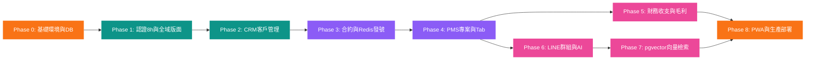

# 立衡軟體開發專案與營運管理系統 - 詳細開發規劃文檔 (Development Roadmap & Verification Plan)

> **文件說明**: 本文件定義立衡軟體開發內部系統之分階段開發計畫。全案劃分為 9 大階段 (Phase 0 ～ Phase 8) 與對應子階段，明確定義每個階段的開發目標、子任務細項、交付成果與具體驗證方式 (自動化測試與手動驗收標準)，作為工程實施與品質驗證之基準依據。

---

## 0. 文件修訂紀錄 (Revision History)

| 版本 | 修訂日期 | 修訂者 | 變更說明 / 摘要 | 審核狀態 |
| :---: | :---: | :---: | :--- | :---: |
| v1.0.0 | 2026-08-14 | PM / Arch Team | 初稿建立：定義 Phase 0 到 Phase 8 之 9 大開發階段、子階段任務、覆蓋率指標與詳細驗收標準。 | 待審核 |

---

## 1. 開發階段依賴關係圖 (Phase Dependencies)

---

## 2. 詳細階段規劃與驗證標準 (Detailed Phases & Verification)

---

### Phase 0: 基礎建設、環境配置與工程骨架搭建 (Foundation & Infrastructure)

#### 0.1 階段目標
建立 Monorepo / pnpm 工作區架構、配置 Docker 本地熱重載環境、PostgreSQL 16 + pgvector 資料庫遷移工具與 Redis 7.2 客戶端。

#### 0.2 子階段任務細項
1. **Phase 0.1: pnpm 工作區與目錄結構初始化**
   * 建立 `frontend/`, `backend/`, `mock/`, `docker/`, `env/` 目錄。
   * 配置 `pnpm-workspace.yaml` 與根目錄腳本 (`dev`, `build`, `test`)。
2. **Phase 0.2: Docker 容器與環境變數 (.env) 配置**
   * 編寫 `docker/local/compose.yaml`，包含 Node.js (熱重載掛載)、PostgreSQL 16 (pgvector)、Redis 7.2 容器。
   * 配置各服務之 `healthcheck` 探針與 `depends_on: condition: service_healthy` 相依啟動順序。
   * 建立 `env/local/` 與 `.env.example`，設定資料庫連線、JWT Secret、Redis 端口。
3. **Phase 0.3: 資料庫 Drizzle ORM、Migration 與健康檢查 API**
   * 配置 Drizzle ORM 連線 Pool，啟用 `uuid-ossp` 與 `vector` 擴充。
   * 執行全量 12 張資料表遷移 (Migration)。
   * 實作後端基礎健康檢查端點 `GET /api/v1/health`、`GET /api/v1/health/liveness` 與 `GET /api/v1/health/readiness`。
4. **Phase 0.4: 前端 Vite + React 18 骨架與 CSS Tokens 建立**
   * 引入 `@kawawei/frontend-modules` 組件庫。
   * 建立 `tokens.css` (亮色主題色票、Icon sm:16px / md:20px / lg:24px 變數)。

#### 0.3 驗證方式 (Verification)
* **自動化測試**:
  * 執行資料庫與快取連線檢測腳本，確認 PostgreSQL 16 (含 `pgvector`) 與 Redis 7.2 連線正常。
  * 整合測試: 請求 `GET /api/v1/health`，驗證回傳 `200 OK` 且包含 DB、Redis 與系統記憶體健康狀態。
* **手動驗證**:
  * 執行 `docker compose -f docker/local/compose.yaml up`，確認容器全部標記為 `(healthy)` 狀態且啟動順序正確。
  * 瀏覽器打開 `http://localhost:5173`，確認前端 Vite 啟動且亮色主題樣式載入正常。

---

### Phase 1: 認證授權、8 小時過期機制與全域版面 (Auth & Layout Shell)

#### 1.1 階段目標
完成使用者登入、JWT 8 小時過期自動跳轉攔截器、雙角色權限控制 (RBAC) 與前端導航版面 (MainLayout)。

#### 1.2 子階段任務細項
1. **Phase 1.1: 後端認證 API 與 JWT 簽發**
   * 實作 `POST /api/v1/auth/login` (BCrypt 密碼校驗，簽發 8h JWT)。
   * 實作 `POST /api/v1/auth/logout` (將 Token JTI 寫入 Redis 黑名單 `auth:blacklist:{jti}`)。
   * 編寫 JWT 認證中間件 (`auth.middleware.ts`) 與角色守衛。
2. **Phase 1.2: 前端 Axios 401 攔截器與 8h Timer 自動跳轉**
   * 封裝 `api-client.ts`，攔截 401 自動清空憑證並跳轉 `/login`。
   * 實作 `useAuth.ts` Hook，監聽 Token 效期定時自動登出。
3. **Phase 1.3: 前端主版面 (MainLayout) 與導航組件**
   * 實作頂部 Header、側邊導航 Sidebar 與文字 Icon (`TextIcon.tsx`)。
   * 依角色動態隱藏財務模組選單 (工程師隱藏 `/finance`)。

#### 1.3 驗證方式 (Verification)
* **自動化測試**:
  * 後端整合測試: `tests/integration/auth.api.test.ts` (測試正確登入 200、密碼錯誤 401、黑名單 Token 攔截 401)。
* **手動驗證**:
  * 以管理員帳號登入成功進入 Dashboard；以工程師帳號登入，確認無「財務收支」導航。
  * 將 Token 效期暫改為 10 秒，驗證 10 秒後前端無需手動刷新直接跳轉登入頁。

---

### Phase 2: 客戶關係管理模組 (CRM)

#### 2.1 階段目標
實現潛在/正式/結案客戶管理、6 階段生命週期流轉、拜訪跟進時間軸與 Zod 欄位防呆。

#### 2.2 子階段任務細項
1. **Phase 2.1: 客戶與跟進後端 API (CRUD)**
   * 實作 `client.schema.ts` (統編 8 碼、電話、必填校驗)。
   * 實作 `ClientController`, `ClientService`, `ClientRepository`。
   * 實作 `POST /api/v1/clients/:id/activity-logs` 新增跟進歷程。
2. **Phase 2.2: 前端客戶清冊與篩選頁面 (`/clients`)**
   * 實作客戶清冊表格、狀態 Badge (待追蹤/追蹤中/已簽約/流失)。
   * 實作搜尋與狀態篩選器 (與 URL Query 綁定)。
3. **Phase 2.3: 客戶新增/編輯彈窗 (`ClientModal`) 與詳情頁 (`/clients/:id`)**
   * 實作乾淨表單 (嚴禁預設假資料)、即時表單驗證紅框提示。
   * 詳情頁展示基本資訊、跟進時間軸、關聯合約與專案。

#### 2.3 驗證方式 (Verification)
* **自動化測試**:
  * 單元測試: `tests/unit/client.schema.test.ts` (驗證統編格式錯誤時拋出 422)。
  * 整合測試: `tests/integration/client.api.test.ts` (驗證客戶 CRUD 與資料庫軟刪除)。
* **手動驗證**:
  * 打開新增表單，確認所有欄位為空；輸入不合規統編，確認表單顯示紅框阻擋送出。
  * 成功新增客戶並添加一筆跟進紀錄，確認時間軸正常展示。

---

### Phase 3: 合約報價單與 Redis 原子單號生成引擎 (Contracts & Numbering Engine)

#### 3.1 階段目標
實作 Redis 原子發號器 (`QT`/`CT`)、合約與報價單管理、5% 營業稅自動計算、PDF 附件上傳與簽署連動。

#### 3.2 子階段任務細項
1. **Phase 3.1: Redis 原子單號生成器**
   * 實作 `code-generator.ts` (透過 Redis `INCR` 發出 `QT-YYYYMMDD-XXXX`, `CT-YYYYMMDD-XXXX`)。
2. **Phase 3.2: 合約後端 API 與狀態機**
   * 實作 `contract.schema.ts`、稅額計算服務。
   * 實作 `PUT /api/v1/contracts/:id/status` (狀態流轉: 洽談中 $\rightarrow$ 待簽署 $\rightarrow$ 已簽署)。
   * 上傳合約用印 PDF / 報價單檔案支援。
3. **Phase 3.3: 前端合約管理清冊與建立表單 (`/contracts`)**
   * 前端即時計算：輸入未稅金額自動算出 5% 稅額與含稅總額。
   * PDF 線上預覽功能。
   * 當合約狀態變更為「已簽署」時，前端彈窗提示一鍵立案 (前往建立專案)。

#### 3.3 驗證方式 (Verification)
* **自動化測試**:
  * 並發測試: `tests/integration/code-generator.test.ts` (50 筆並發請求驗證單號完全唯一)。
  * 單元測試: 稅額公式計算測試 (100,000 未稅 $\rightarrow$ 5,000 稅額 $\rightarrow$ 105,000 含稅)。
* **手動驗證**:
  * 建立一張報價單，確認單號為 `QT-當日日期-0001`。
  * 上傳合約 PDF 檔案並將狀態改為「已簽署」，確認系統彈出立案提示。

---

### Phase 4: 專案研發 7 大階段與協同模組 (PMS, Milestones & QA)

#### 4.1 階段目標
實現專案案號自動發號 (`PJ`)、7 大生命週期階段看板、URL 標籤頁狀態保持、工程師進度回報日誌與 Bug 缺陷監控。

#### 4.2 子階段任務細項
1. **Phase 4.1: 專案後端核心 API**
   * 實作專案 CRUD、里程碑 API、進度日誌 API、QA Bug 缺陷 API。
   * 實作線上系統健康狀態更新 (正常/警告/異常)。
2. **Phase 4.2: 前端專案 7 大階段看板與清單 (`/projects`)**
   * 支援 7 階段看板 (提案 $\rightarrow$ 規格 $\rightarrow$ 開發 $\rightarrow$ 測試 $\rightarrow$ 交付 $\rightarrow$ 維運 $\rightarrow$ 結案)。
   * 專案卡片展示里程碑進度條 (%)、健康度指示燈。
3. **Phase 4.3: 專案核心詳情頁與 URL 標籤頁 Hook (`/projects/:id`)**
   * 封裝 `useUrlTabs.ts`，5 大 Tab 頁籤 (`milestones`, `logs`, `qa`, `line_sync`, `finance`) 與 URL 參數雙向綁定。
   * 實作工程師填寫進度日誌彈窗 (填寫阻礙時自動觸發專案黃色警告)。
   * 實作 QA Bug 清單管理 (Critical / Major / Minor)。

#### 4.3 驗證方式 (Verification)
* **自動化測試**:
  * 前端 Hook 測試: `src/hooks/__tests__/useUrlTabs.test.ts` (驗證 F5 重新整理不回退 Tab)。
  * 後端 API 測試: 提交進度日誌與更新 Bug 狀態整合測試。
* **手動驗證**:
  * 進入專案詳情頁點選 `Tab 2: 日誌`，按瀏覽器 F5 重新整理，確認精確停留在日誌標籤頁，未回退首頁。
  * 填寫一筆包含「技術阻礙」的進度日誌，確認專案健康燈號轉為警告。

---

### Phase 5: 財務收支、多階段收款核銷與專案毛利 (Finance, Receivables & P&L)

#### 5.1 階段目標
實現多階段收款期程 (`REC`)、發票開立與銀行帳戶入帳核銷、專案支出 vs 公司支出 (`EXP`)、即時毛利結算與 Excel/CSV 匯出。

#### 5.2 子階段任務細項
1. **Phase 5.1: 財務後端 API 與毛利結算引擎**
   * 實作多階段收款 API (`REC-YYYYMMDD-XXXX`)：開立發票與銀行入帳核銷。
   * 實作支出管理 API (`EXP-YYYYMMDD-XXXX`)：區分專案專屬 vs 公司共用。
   * 實作公司銀行帳戶維護 API。
   * 實作專案毛利計算公式：$\text{實際毛利} = \text{已入帳總額} - \text{專案總支出}$。
2. **Phase 5.2: 前端財務收款與支出清冊頁面 (`/finance/*`)**
   * 實作多階段收款列表：逾期未付醒目紅色警示。
   * 實作「開立發票」與「確認入帳」核銷彈窗 (選擇公司銀行帳戶)。
   * 實作支出提報表單 (支援憑證附件圖檔上傳)。
3. **Phase 5.3: 專案損益總表與 Excel / CSV 匯出**
   * 專案毛利率看板。
   * 實作一鍵匯出按鈕，生成標準收支與發票清冊試算表。

#### 5.3 驗證方式 (Verification)
* **自動化測試**:
  * 單元測試: `tests/unit/finance.service.test.ts` (測試 5% 稅額、毛利 18 萬 / 毛利率 60.0% 計算與除以零防呆)。
  * 整合測試: 測試款項入帳核銷後，專案已收金額與毛利即時變更。
* **手動驗證**:
  * 為某專案設定 3 階段收款，執行第 1 階段請款並填寫發票號碼 `AB-12345678`。
  * 執行入帳核銷至「台北富邦帳戶」，確認專案毛利看板即時更新。
  * 點擊「匯出 Excel」，確認下載的檔案欄位與金額正確無誤。

---

### Phase 6: LINE 專案群組雙向協同與 AI 智能助理 (Social & AI Agent)

#### 6.1 階段目標
實作 LINE 官方 Bot 邀請進專案群組 (方案 B)、Webhook 訊息同步、後台雙向訊息發送至 LINE 群、@AI 指令與待辦提煉。

#### 6.2 子階段任務細項
1. **Phase 6.1: LINE Messaging API Webhook 接收與群組綁定**
   * 實作 `POST /api/v1/integrations/line/webhook` (LINE 簽名校驗)。
   * 處理 `join` 事件 (取得 `groupId`)，後台提供一鍵綁定專案功能。
   * 處理 `message` 事件 (文字、圖片)，存入 `project_line_messages`。
2. **Phase 6.2: WebSocket 即時串流推播至前端**
   * 後端收到 LINE Webhook 時，透過 WebSocket 發布 `line:message_new`。
   * 前端專案詳情 `Tab 4: LINE 動態` 即時 Append 新對話 (無刷新)。
3. **Phase 6.3: 後台雙向發布與 AI 智能助理**
   * 前端輸入文字點擊「發送至 LINE 群」，後端調用 LINE Push Message API 推播至該群組。
   * 群組 `@AI助理` 互動指令解析與自動建立待辦任務。

#### 6.3 驗證方式 (Verification)
* **自動化測試**:
  * 測試 Webhook 簽名驗證機制 (偽造簽名回傳 403)。
* **手動驗證 (LINE 聯調)**:
  * 在個人 LINE 與客戶的專案群組中邀請 LINE Bot。
  * 在群組中發送測試訊息「首頁按鈕失效」，確認系統後台專案頁籤即時無刷新跳出該對話。
  * 在系統後台輸入「工程師正在排查中」並發送，確認 LINE 專案群組即刻收到 Bot 推播訊息。

---

### Phase 7: 全局向量語意檢索與 RAG 專案問答 (pgvector & Semantic Search)

#### 7.1 階段目標
實現基於 PostgreSQL `pgvector` 的全域資料向量化、`Cmd + K` 自然語言語意搜尋與 AI 專案問答 (RAG)。

#### 7.2 子階段任務細項
1. **Phase 7.1: 資料向量化管線 (Vector Pipeline)**
   * 客戶、合約、進度日誌、LINE 溝通紀錄新增/修改時，調用 Embedding API 生成 1536 維向量存入 `embedding_vectors`。
   * 建立 IVFFlat 餘弦相似度索引。
2. **Phase 7.2: 全局向量搜尋 API 與介面 (`/search`)**
   * 實作 `POST /api/v1/ai/semantic-search` (計算 Cosine Distance 取得 Top 5 關聯資料)。
   * 前端實作 `Cmd + K` 快捷鍵喚起自然語言搜尋框。
3. **Phase 7.3: AI 專案問答對話視窗 (RAG Chat)**
   * 實作 `POST /api/v1/ai/chat-rag` (檢索向量上下文組裝 Prompt 進行專案狀態問答)。

#### 7.3 驗證方式 (Verification)
* **自動化測試**:
  * 測試向量檢索 API 響應時間 $< 800\text{ms}$。
* **手動驗證**:
  * 在全局搜尋框輸入自然語言：「*上次詢問物聯網的客戶是誰？*」，驗證系統精準找出對應客戶卡片並支援點擊跳轉。
  * 向 AI 提問：「*專案 A 目前進度卡在哪裡？*」，驗證 AI 根據工程師進度日誌精準回答。

---

### Phase 8: PWA 行動裝置支援、全鏈路驗收與 Docker 生產部署 (PWA, E2E & Delivery)

#### 8.1 階段目標
完成 PWA 手機桌面安裝配置、全系統單元與整合測試覆蓋率檢查 ($\ge 85\%$)、Docker 多階段建構與正式部署驗收。

#### 8.2 子階段任務細項
1. **Phase 8.1: PWA 配置與行動裝置適配**
   * 配置 `manifest.json` 與 Service Worker 快取。
   * 驗證 iOS Safari (加入主畫面) 與 Android Chrome (安裝應用程式) 獨立全螢幕運行。
2. **Phase 8.2: 全鏈路自動化測試與覆蓋率稽核**
   * 執行全量測試套件 (`pnpm test:coverage`)，確保核心商業邏輯覆蓋率 $\ge 85\%$。
3. **Phase 8.3: Docker 生產環境多階段構建**
   * 編寫 `docker/server/Dockerfile.frontend.prod` 與 `Dockerfile.backend.prod`。
   * 執行生產建構，驗證產物映像檔體積 $< 150\text{MB}$。

#### 8.3 驗證方式 (Verification)
* **自動化測試**:
  * 執行 `pnpm test:coverage`，確認終端機輸出 Coverage Report 全部達標綠燈。
* **手動驗證**:
  * 在手機瀏覽器打開系統，點擊「安裝至桌面」，確認可從手機桌面圖標啟動且無瀏覽器網址列干擾。
  * 執行端到端業務全流程驗收：客戶建立 $\rightarrow$ 合約簽署 $\rightarrow$ 專案立案 $\rightarrow$ 工程師回報日誌 $\rightarrow$ LINE 對話同步 $\rightarrow$ 款項核銷入帳 $\rightarrow$ 匯出報表。
