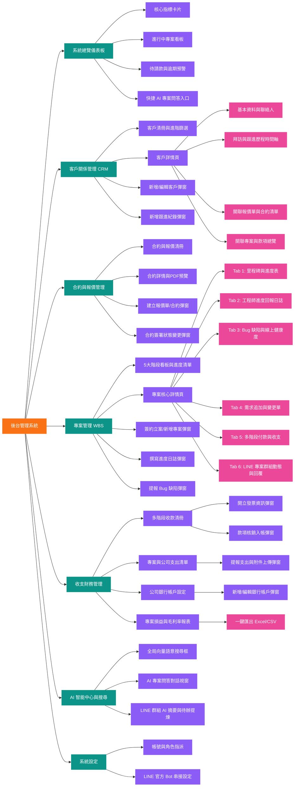

# 後台頁面結構文檔

> **說明**: 本文檔定義立衡軟體開發內部系統之完整後台頁面結構與層級展開圖。請使用支援 Mermaid 預覽之 Markdown 編輯器檢視。本結構圖嚴格採用左至右 (LR) 展開，並套用標準四級樣式規範。

---

## 1. 頁面結構層級樹狀圖 (Page Hierarchy Tree)

---

## 2. 頁面詳細層級清單與功能說明

### 2.1 Level 1: 系統主入口
* **後台管理系統 (Root)**: 系統全域佈局，包含頂部全局搜尋列、即時通知中心、使用者資訊選單與側邊導航欄。

---

### 2.2 Level 2: 核心功能模組
1. **系統總覽儀表板 (Dashboard)**: 全公司專案、營收、待收款與客戶概況一覽。
2. **客戶關係管理 (CRM)**: 客戶全生命週期管線、跟進紀錄與合約關聯。
3. **合約與報價管理 (Contracts)**: 報價單、委託合約、PDF 上傳與狀態流轉。
4. **專案管理 (WBS)**: 專案 5 大階段、工期結案日試算、需求追加變更單、多階段計稅付款、工程師進度回報、QA 缺陷、LINE 動態。
5. **收支財務管理 (Finance)**: 多階段請款核銷、專案支出 vs 公司支出、銀行帳戶、損益報表。
6. **AI 智能中心與搜尋 (AI Center)**: pgvector 向量語意檢索、AI 專案問答、群組對話提煉。
7. **系統設定 (Settings)**: 帳號管理、雙角色權限配置、LINE Bot Webhook 設定。

---

### 2.3 Level 3 & 4: 頁面、標籤頁 (Tabs) 與互動彈窗 (Modals)

| 模組名稱 | 頁面名稱 (Level 3) | 子分頁 / 標籤頁 (Level 4) | 彈窗與操作組件 (Modals) |
| :--- | :--- | :--- | :--- |
| **CRM** | 客戶清冊 (`/clients`) | 待洽談 / 洽談中 / 待簽約 / 合作中 / 已交付 / 未成交 | `ClientFormModal` (新增客戶彈窗) |
| | 客戶詳情 (`/clients/:id`) | 獨立頁面: 【客戶基本資料與需求編輯】、 【聯繫歷史時間軸 (FB/IG/Threads/LINE/電話)】 | 狀態動態切換選單、客戶刪除確認彈窗 |
| **WBS** | 專案看板 (`/projects`) | 5 大階段清單與篩選視圖 (開發中/測試/交付/保固/結案) | `ProjectCreateModal` (簽約立案/新增專案) |
| | 專案詳情 (`/projects/:id`)| `tab=milestones` (里程碑進度) `tab=logs` (工程師進度日誌) `tab=qa` (Bug 缺陷與健康度) `tab=change_orders` (需求追加與變更單) `tab=finance` (多階段付款與收支) `tab=line_sync` (LINE 雙向動態) | `LogCreateModal` (填寫進度日誌) `BugCreateModal` (提報 Bug) `ChangeOrderModal` (建立變更單) `LineReplyBox` (後台雙向回傳) |
| **Finance** | 收款清冊 (`/finance/receivables`) | 待請款 / 已請款 / 已入帳 / 逾期 | `InvoiceModal` (開立發票) `ReceiveConfirmModal` (核銷入帳) |
| | 支出清冊 (`/finance/expenses`) | 專案專屬支出 / 公司營運支出 | `ExpenseCreateModal` (提報支出) |
| | 銀行帳戶 (`/finance/bank-accounts`)| 銀行帳戶清單 | `BankAccountModal` (新增/編輯帳戶) |
| | 損益報表 (`/finance/profitability`)| 專案毛利總表、毛利率即時分析 | `ExportAction` (匯出 Excel/CSV) |
| **AI** | 向量檢索 (`/search`) | 自然語言搜尋結果 (客戶/合約/專案/對話) | `AIRagChatModal` (專案問答) |
