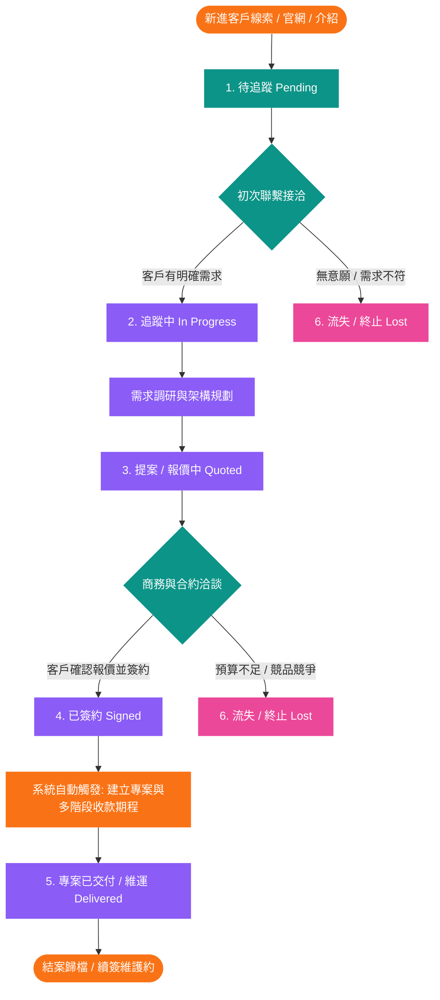
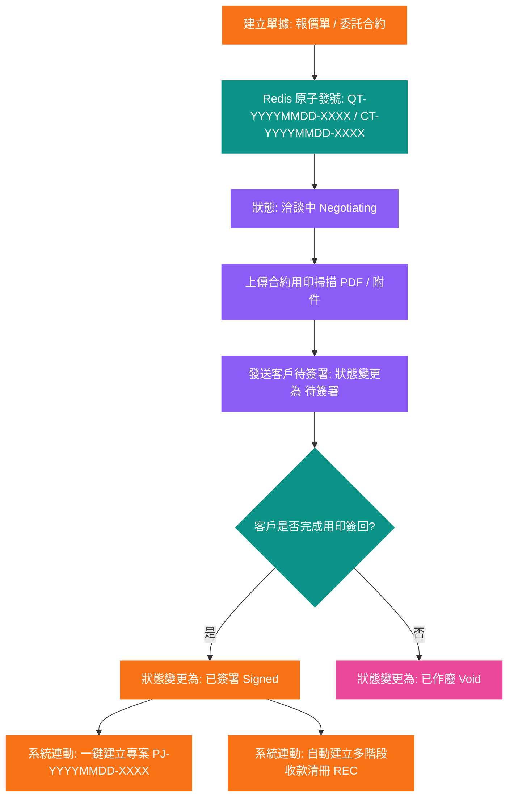
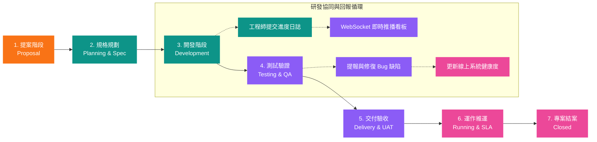
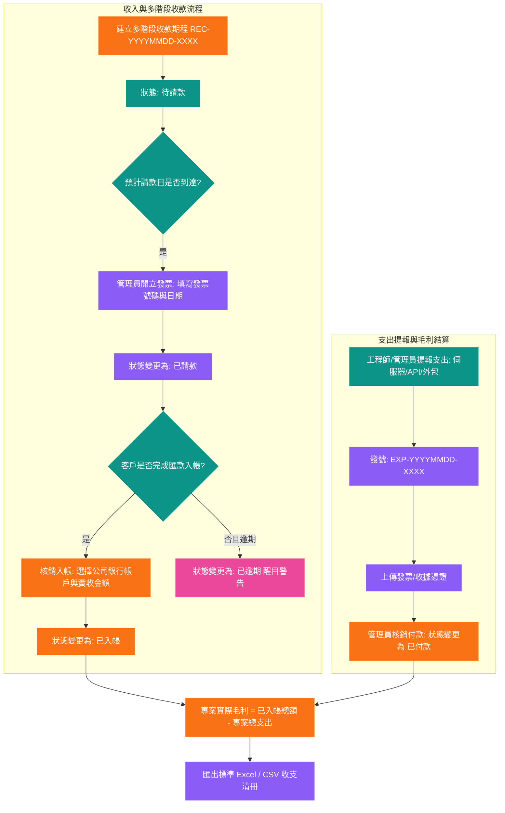
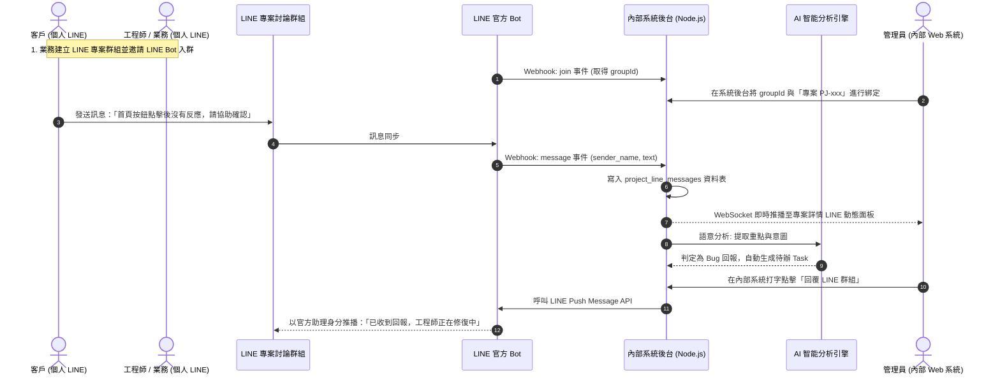
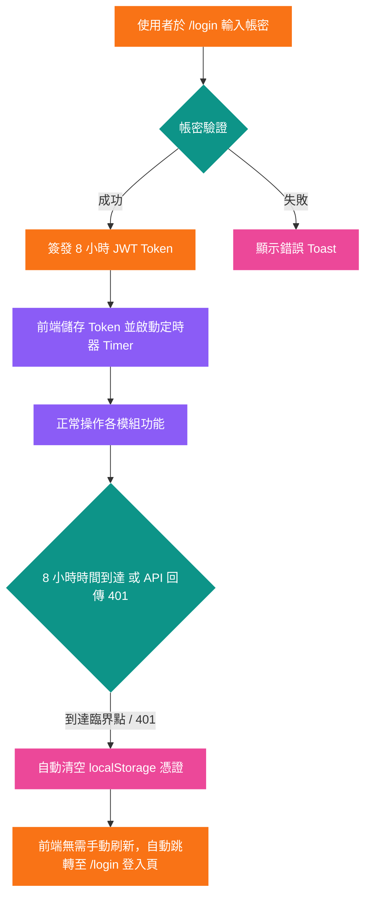

# 系統業務流程圖文檔

> **說明**: 本文檔詳細繪製立衡軟體開發內部系統之六大核心業務流程圖，包含商務客戶生命週期、合約簽署立案、專案管理 7 階段、多階段收支毛利核銷、LINE 群組 AI 雙向協同與 8 小時憑證安全機制。請使用支援 Mermaid 預覽之 Markdown 編輯器檢視。

---

## 1. 客戶全生命週期與商務流轉流程圖 (CRM Lifecycle Flow)

---

## 2. 合約簽署與專案立案流程圖 (Contracts to Project Flow)

---

## 3. 專案管理 7 大階段與協同流程圖 (WBS Lifecycle Flow)

---

## 4. 多階段收款、發票開立與支出毛利核銷流程圖 (Finance Flow)

---

## 5. LINE 專案群組協同與 AI 雙向處理時序圖 (Social & AI Agent Sequence)

---

## 6. 憑證 8 小時過期自動跳轉流程圖 (Auth & Expiration Flow)

